# Módulo 1: Fundamentos y conceptos clave

## Clase 1
## **Inauguración y conceptos fundamentales de datos, roles, servicios y cargas de trabajo**
  - Se transmitió el: viernes 27 de Septiembre a las 20:00  
  - [Ver grabación](https://codigofacilito.com/videos/introduccion-conceptos-fundamentales-de-datos-roles-servicios-y-cargas-de-trabajo)

# Índice

## - [1) Conceptos fundamentales](#01-conceptos-fundamentales)
## - [2) Cargas de trabajo](#02-cargas-de-trabajo)
## - [3) Roles profesionales](#03-roles-profesionales)
## - [4) Servicios](#04-servicios)


---


# 01-Conceptos fundamentales

## **¿Qué son los datos?**   
Valores usados (Ej: Coleccion de elementos, numeros, texto, observaciones) que registran información, a menudo representando **entidades** que tienen uno o varios **atributos**.

## **Los podemos clasificar en 3 tipos:**


- ###  **Datos estructurados:** 
Son aquellos que la estructura de la información se define con anterioridad, en un esquema fijo, estricto. Campos, propiedades, columnas. (Ej: Base de datos relacionales como en SQLServer, MySQL, Oracle)

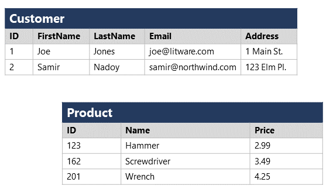

- ###  **Datos semiestructurados:** 
En estos la estructura está predefinida pero son más flexibles. Permite diferencias entre los registros, pueden haber atributos en uno y en otros no (Ej: JSON)

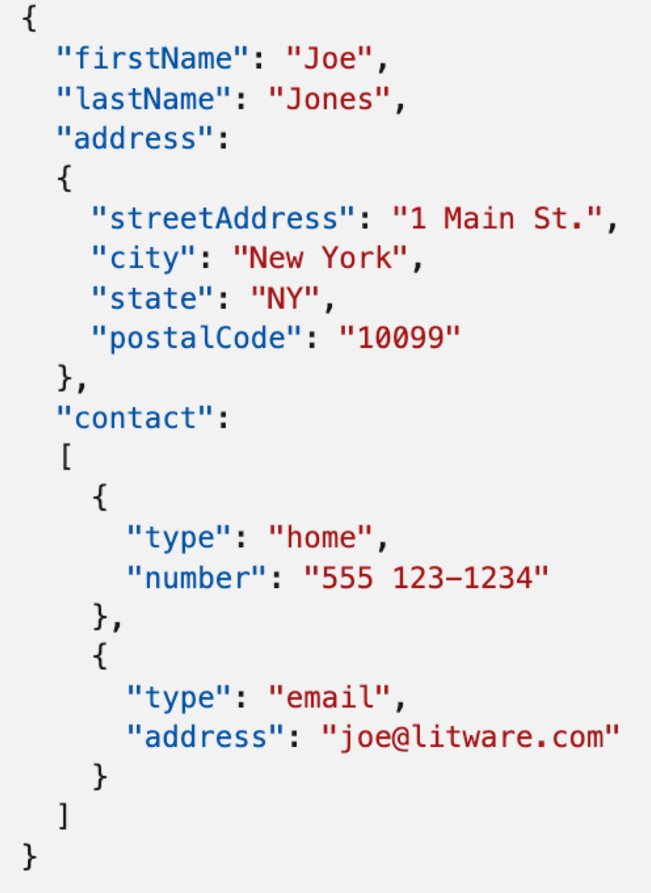


- ###  **Datos no estructurados:**
En estos elementos no hay un esquema. (Ej: archivos binarios, pdf, imagenes, videos, audio, archivos de word, el pdf de un correo electrónico, etc)


## ¿Cómo se almacenan los datos?
Por ahora vamos a ver 2 tipos de almacenes. Archivos y Base de datos.

###  Archivos:

- #### Texto delimitado 
  Por ejemplo archivos CSV ("Comma Separated Values" o "Valores separados por comas"). Un archivo CSV es cualquier archivo de texto en el cual los caracteres están separados por comas, haciendo una especie de tabla en filas y columnas. Las columnas quedan definidas por cada  coma (,) o punto y coma (;) , mientras que cada fila se define mediante una línea adicional en el texto.
```
FirstName,LastName,Email
Joe,Jones,joe@litware.com
Samir,Nadoy,samir@northwind.com
```

- #### Notación de objetos JavaScript (JSON)
  En este tipo de archivos se puede definir una jerarquía. Es decir un objeto puede contener otro objeto dentro.
  
```json
{
  "customers": [
    { "firstName": "Joe", "lastName": "Jones" },
    { "firstName": "Samir", "lastName": "Nadoy" }
  ]
}
```

- #### Lenguaje de marcado extensible (XML)
  *Ultimamente en poco uso ya que se esta optando por JSON*
```xml
<Customer firstName="Joe" lastName="Jones" />
```

- #### Objeto binario grande (BLOB)
  Ej: archivos grandes como imagenes, videos, pdf
```
10110101101010110010...
```

- #### Formatos optimizados:  
    - #### Avro   
      Organiza los datos en filas. Similar a JSON. Pero tiene un encabezado con metadatos. Creado por Apache.  

      - 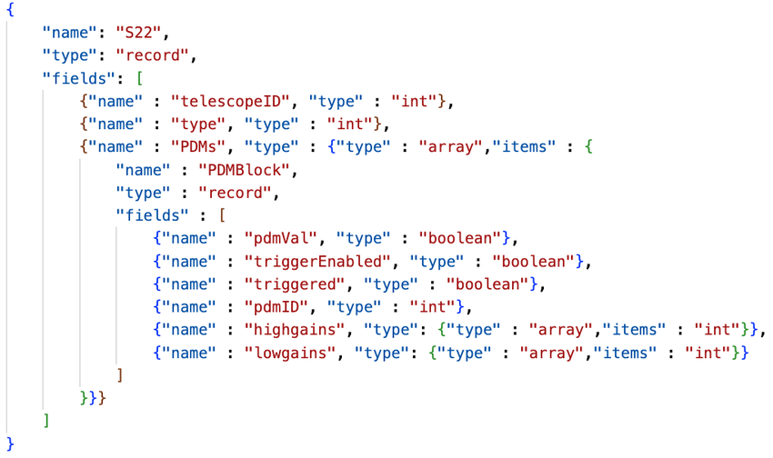 
  
    - #### ORC  
      Organiza los datos en columnas. Hay que verlo las columnas son renglones, al reves de lo que estamos acostumbrados.

      - 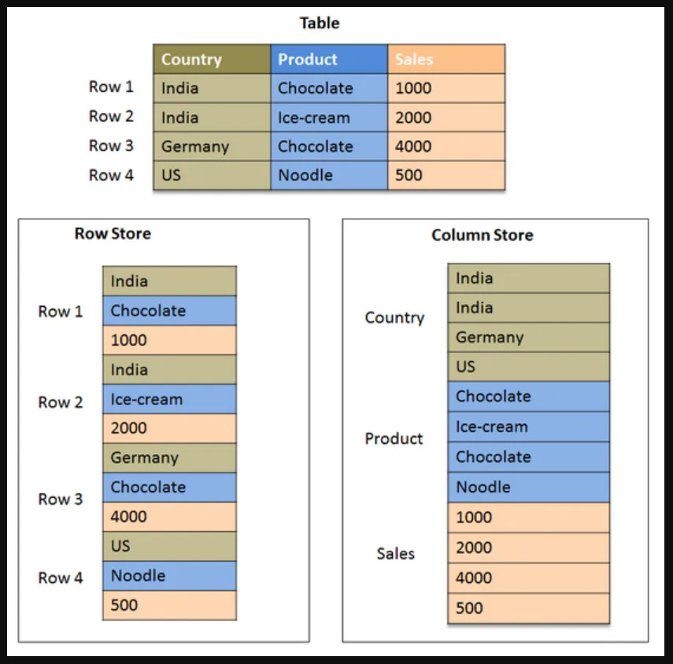  
    
    - #### Parquet  
      Similar a ORC, basado en columnas. Los datos de cada columna se almacenan juntos en un grupo de filas. Se utiliza en analítica , con Data lakes, con Spark. Esta pensado para encontrar datos rapidamente.

      - 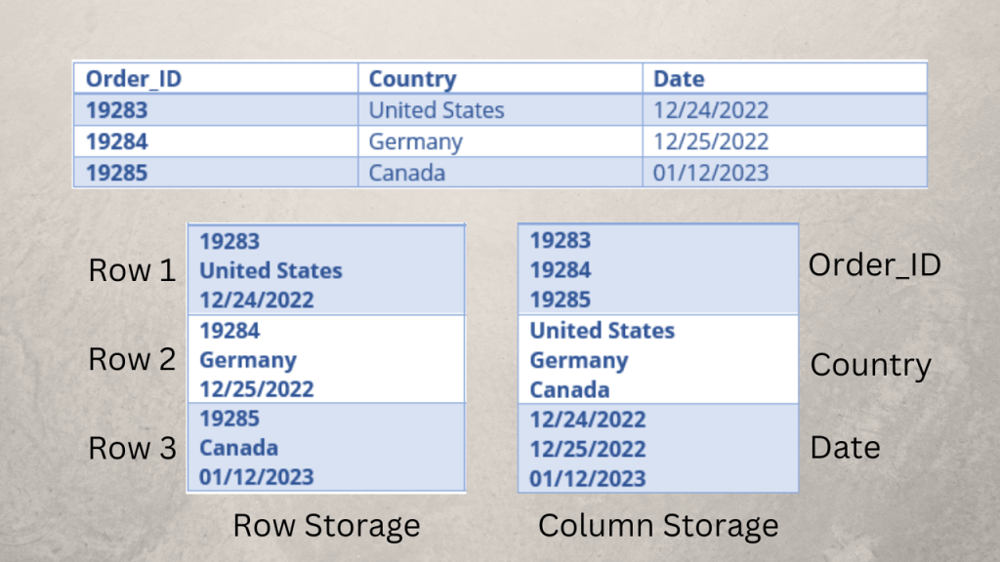  


### Bases de datos:
  Sistema central donde vamos a poder tener nuestros datos. Se utiliza no solo para almacenar información , sino tambien para , consultarla, editarla, eliminarla de una manera mas ágil que un archivo de texto simple.

- #### Relacional
  Las bases de datos relacionales almacenan datos estructurados. Pero actualmente tambien se utilizan JSON. 
  
  - 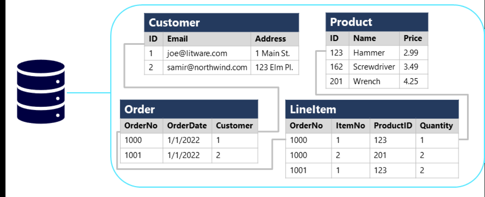  


- #### No Relacional
  Acá es donde entran los datos semiestructurados. Que admiten distintas formas de organizar la información:

  - **Key-Value (Clave-Valor)**  
    La llave no se puede repetir. A cada una le corresponde un valor
    -   
  
  - **Documento**  
    Similar a Clave-Valor pero el valor es una cadena JSON
    -   

  - **Column-Family (Familia de columnas)**  
    Similar al relacional, pero cada tabla son columnas. Es decir cada columna puede agrupar mas de un dato. una columna dentro de otra.
    - 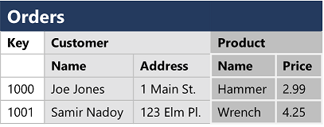  


  - **Graph (Grafos)**  
    Compuesto por datos semiestructurados.La información se guarda en nodos, y estos se relacionan entre ellos .
    - 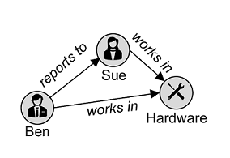  


---


# 02-Cargas de trabajo  
En esta parte vamos a ver como se procesa la información.  
Tenemos 2 tipos **Workloads transaccionales** y **Workloads analíticos**. 
Es decir **Cargas de trabajo de datos transaccionales** y **Cargas de trabajo de datos analíticos**.

## Cargas de trabajo de datos transaccionales OLTP
**Tambien conocidas como  Cargas de trabajo de datos operativos**

Los datos se almacenan en una base de datos optimizada para **operaciones de procesamiento de transacciones en línea (OLTP)** que admite operaciones de lectura o escritura.

**Por ejemplo:**
- Leer la tabla Product (tabla Producto) para mostrar un catálogo
- Escribir en la tabla Order para registrar una compra

Los datos se almacenan mediante **transacciones**.

Las transacciones se basan en "ACID":
- **Atomicidad**: cada transacción se trata como una unidad única de trabajo, la cual se completa correctamente o produce un error general.
- **Coherencia**: las transacciones solo pueden pasar los datos de la base de datos de un estado válido a otro.
- **Aislamiento**: las transacciones simultáneas no pueden interferir entre sí.
- **Durabilidad**: cuando una transacción se ha realizado con éxito, los cambios en los datos se conservan en la base de datos.


### Ejemplo de una transacción
1 - Comienza la transacción  
2 - Accede a tu cuenta de cheques en un cajero automático  
3 - Solicita un retiro de $100  
4 - La máquina confirma que el balance de tu cuenta es $200  
5 - La máquina disminuye tu cuenta bancaria en $100  
6 - El balance actual de tu cuenta es $100  
7 - La máquina expide los $100 en efectivo  
8 - Finaliza la transacción  


### Otros ejemplos de operaciones transaccionales
- Retiro de una cuenta bancaria
- Confirmar la compra de las verduras que te encargó tu mamá
- Compras en línea
- Registro de información de sensores


## Cargas de trabajo de datos analíticos OLAP
En este caso, hablamos de grandes cantidades de información. Consiste en reunir información de distintos tipos de datos.
Acá aparece el término de **Data Warehouse**, bodega de datos o **almacenes de datos** (no confundir con almacenamiento de datos). 
Estos Data Warehouse guardan la información en un esquema relacional pero, estan **optimizadas para tareas de lectura**, es decir a consultas para crear reportes , análisis.
Tambien se suele usar el formato Parquet. 


### Flujo de una carga de trabajo de datos analíticos

1. Los datos operativos se extraen, transforman y cargan (ETL) en un lago de datos para su análisis.
2. Los datos se cargan en un esquema de tablas: normalmente en un almacén de lago de datos basado en Spark con abstracciones tabulares en los archivos del lago de datos o en un almacenamiento de datos con un motor SQL totalmente relacional.
3. Los datos de las tablas se pueden agregar y cargar en un **modelo de procesamiento analítico en línea (OLAP)** o cubo.
4. Los archivos del lago de datos, las tablas relacionales y el modelo analítico se pueden consultar para generar informes y paneles.


### Resumen

- Contienen datos históricos de muchos años.
- Se almacenan hasta un nivel de granularidad que es útil para analítica.
- Típicamente, son de solo lectura.
- Se obtienen a partir de sistemas OLTP.

**Granularidad:** nivel de detalle de los datos almacenados.

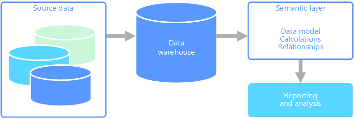


### Cuestionario 

1. ¿Cómo se organizan los datos en una tabla relacional?
   - [X] En filas y columnas
   - [  ] En el encabezado y en el pie de página
   - [  ] En páginas y párrafos

2. ¿Cuál de los siguientes constituye un ejemplo de datos no estructurados?
   - [  ] Un archivo de texto delimitado por comas con los campos EmployeeID, EmployeeName y EmployeeDesignation
   - [X] Archivos de audio y vídeo
   - [  ] Una tabla en una base de datos relacional

3. ¿Qué es un almacén de datos (data warehouse)?
   - [  ] Una base de datos no relacional optimizada para operaciones de lectura y escritura
   - [X] Una base de datos relacional optimizada para operaciones de lectura
   - [  ] Una ubicación de almacenamiento para archivos de datos no estructurados


---

# 03-Roles profesionales 
Vamos a ver Administradores de datos, Ingenieros de datos, Analistas de datos, pero no son los únicos. Hay más como por ejemplo científico de datos , arquitecto de datos, etc.


## Administrador de base de datos

- Un administrador de base de datos de Azure es responsable del **diseño**, la **implementación**, el **mantenimiento** y los aspectos operativos de los sistemas de BD locales y los basados en la nube.
- Son responsables de la **disponibilidad general**, las **optimizaciones** y el **rendimiento** coherente de las BDs.
- Trabajan con las partes interesadas para implementar **directivas**, **herramientas** y **procesos** para la realización de **copias de seguridad**, así como **planes de recuperación** que permiten reponerse tras un desastre natural o un error humano.
- También son responsables de administrar la **seguridad de los datos** en la BD, **conceder privilegios** sobre los datos, y **conceder o denegar el acceso** a los usuarios según corresponda.


## Ingeniero de datos

- Los ingenieros de datos colaboran con las partes interesadas para **diseñar e implementar cargas de trabajo** relacionadas con datos, incluidas **canalizaciones (pipelines) de ingesta de datos**, actividades de **limpieza y transformación**, y data warehousing para cargas de trabajo analíticas.
- Usan una amplia gama de tecnologías de plataforma de datos, como BD relacionales y no relacionales, data warehouses y flujos de datos.
- Son responsables de garantizar que la **privacidad** de los datos se mantenga dentro de la nube y que abarque desde el entorno local hasta los almacenes de datos en la nube.
- Se ocupan de la **administración** y la **supervisión** de canalizaciones de datos para asegurarse de que las cargas de datos funcionen según lo previsto.


## Analista de datos

- Los analistas de datos ayudan a las empresas a **maximizar el valor** de sus recursos de datos.
- Son los responsables de **explorar datos** para identificar **tendencias y relaciones**, **diseñar e implementar modelos analíticos**, y habilitar funcionalidades de análisis avanzado mediante informes (reportes) y visualizaciones.
- Los analistas de datos se ocupan del procesamiento de los datos crudos (sin procesar) para convertirlos en información pertinente, en función de los requisitos empresariales establecidos, con el fin de ofrecer conclusiones de interés.


## Resumen

## Administrador de base de datos
- Aprovisionamiento, configuración y gestión de bases de datos
- Seguridad de la base de datos y acceso de usuario
- Copias de seguridad y resistencia de la BD
- Supervisión y optimización del rendimiento de la BD

## Ingeniero de datos
- Canalizaciones de integración de datos y procesos ETL
- Limpieza y transformación de datos
- Esquemas y cargas de datos del almacén de datos analíticos

## Analista de datos
- Modelado analítico
- Informes y resumen de datos
- Visualización de datos


---

# 04-Servicios 

Servicios de Azure más usados para trabajar con datos


# Servicios en la nube de Microsoft para datos

## Cargas de trabajo de datos operativos 
- Azure SQL  
  Familia de servicios de bases de datos relacionales basados en SQL Server
 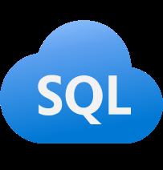  
- Azure Database para open-source:
  - MariaDB  
   
  - MySQL  
   
  - PostgreSQL  
   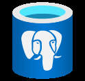
- Azure Cosmos DB:  
  Sistema de base de datos no relacional altamente escalable
 
- Azure Storage:  
  - Archivo, blob y almacenamiento de tabla
  - Espacio de nombres jerárquico para almacenamiento en un lago de datos  
 


## Cargas de trabajo de datos analíticos 

### Software como servicio (SaaS)
#### **Microsoft Fabric**  
    
Plataforma analítica unificada, basada en SaaS, basada en un almacén de lago abierto y gobernado:
- Ingesta de datos y ETL
- Almacén de lago de datos
- Data Warehouse
- Ciencia de datos y ML
- Análisis en tiempo real
- Visualización de datos
- Gobernanza y administración de datos

### Plataforma como servicio (PaaS)
**Azure Synapse Analytics**
- Solución integrada para el análisis de datos en Azure
- Canalizaciones, Apache Spark, SQL, Data Explorer

**Azure Databricks**
- Análisis y procesamiento de datos de Apache Spark

**Azure HDInsight**
- Plataforma de código abierto de Apache


### Cuestionario 

1. **¿Cuál de las tareas siguientes es responsabilidad del administrador de base de datos?**
   - [X] Realizar copias de seguridad de las bases de datos y restaurarlas
   - [ ] Crear paneles e informes
   - [ ] Crear canalizaciones para procesar datos en un lago de datos

2. **¿Qué rol es más probable que use Azure Data Factory para definir una canalización de datos para un proceso ETL?**
   - [ ] Administrador de base de datos
   - [X] Ingeniero de datos
   - [ ] Analista de datos

3. **¿Qué servicios usaría como solución SaaS para el análisis de datos?**
   - [ ] Azure SQL Database
   - [X] Microsoft Fabric
   - [ ] Azure Synapse Analytics


----------- 

## ¿Qué has aprendido hoy?

Los datos son la esencia de la mayoría de las aplicaciones y soluciones de software.  
Se pueden representar en muchos formatos, almacenarse en archivos y bases de datos, y usarse para registrar transacciones o para admitir los análisis y la realización de informes.  

La administración y el trabajo con datos es una aptitud especializada que requiere el conocimiento de varias tecnologías.  
La mayoría de las organizaciones definen roles de trabajo para las distintas tareas relacionadas con la administración de datos.


## Directorio de links

- **Exploración de los conceptos de datos principales:**  
  [https://learn.microsoft.com/es-mx/training/modules/explore-coredata-concepts/](https://learn.microsoft.com/es-mx/training/modules/explore-coredata-concepts/)

- **Exploración de roles y servicios de datos:**  
  [https://learn.microsoft.com/es-mx/training/modules/explore-roles-responsibilities-world-of-data/](https://learn.microsoft.com/es-mx/training/modules/explore-roles-responsibilities-world-of-data/)
