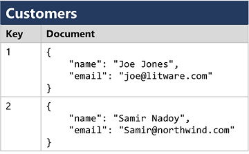

# Módulo 1: Fundamentos y conceptos clave

## **Inauguración y conceptos fundamentales de datos, roles, servicios y cargas de trabajo**
  - Se transmitió el: viernes 27 de Septiembre a las 20:00  
  - [Ver grabación](https://codigofacilito.com/videos/introduccion-conceptos-fundamentales-de-datos-roles-servicios-y-cargas-de-trabajo)


### 01) Conceptos fundamentales [(ir al detalle)](#01)
Conceptos básicos de los datos.

### 02) Cargas de trabajo
Transaccionales y Analíticas.

### 03) Roles profesionales
Administradores, Ingenieros y Analistas de datos.

### 04) Servicios
Servicios de Azure más usados para trabajar con datos.

---

# 01) Conceptos fundamentales {#01}

## **¿Qué son los datos?**   
Valores usados (Ej: Coleccion de elementos, numeros, texto, observaciones) que registran información, a menudo representando **entidades** que tienen uno o varios **atributos**.

## **Los podemos clasificar en 3 tipos:**


- ###  **Datos estructurados:** 
Son aquellos que la estructura de la información se define con anterioridad, en un esquema fijo, estricto. Campos, propiedades, columnas. (Ej: Base de datos relacionales como en SQLServer, MySQL, Oracle)


- ###  **Datos semiestructurados:** 
En estos la estructura está predefinida pero son más flexibles. Permite diferencias entre los registros, pueden haber atributos en uno y en otros no (Ej: JSON)


- ###  **Datos no estructurados:**
En estos elementos no hay un esquema. (Ej: archivos binarios, pdf, imagenes, videos, archivos de word, etc)


## ¿Cómo se almacenan los datos?
Por ahora vamos a ver 2 tipos de almacenes. Archivos y Base de datos.

###  Archivos:

- #### Texto delimitado
```
FirstName,LastName,Email
Joe,Jones,joe@litware.com
Samir,Nadoy,samir@northwind.com
```

- #### Notación de objetos JavaScript (JSON)
```json
{
  "customers": [
    { "firstName": "Joe", "lastName": "Jones" },
    { "firstName": "Samir", "lastName": "Nadoy" }
  ]
}
```

- #### Lenguaje de marcado extensible (XML)
```xml
<Customer firstName="Joe" lastName="Jones" />
```

- #### Objeto binario grande (BLOB)
```
10110101101010110010...
```

- #### Formatos optimizados:  
    - #### Avro   
      -   
    - #### ORC  
      -   
    - #### Parquet  
      -   


### Bases de datos:

- #### Relacional
  -   


- #### No Relacional

  - Documento  
    -   

  - Key-Value (Clave-Valor)  
    -   

  - Graph (Grafos)  
    -   

  - Column-Family (Familia de columnas)  
    -   