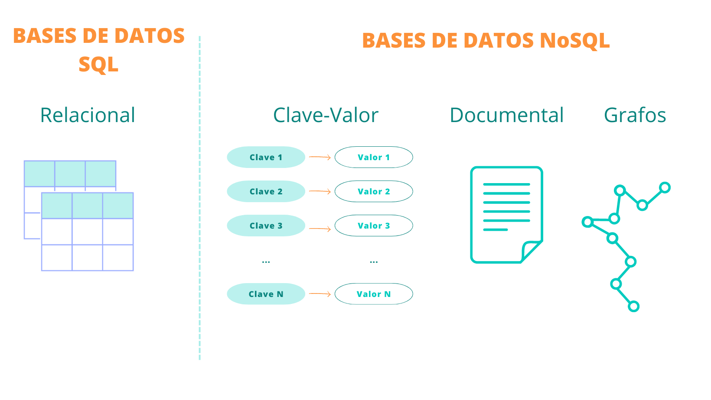
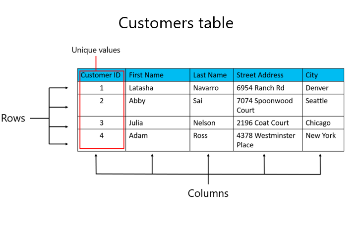
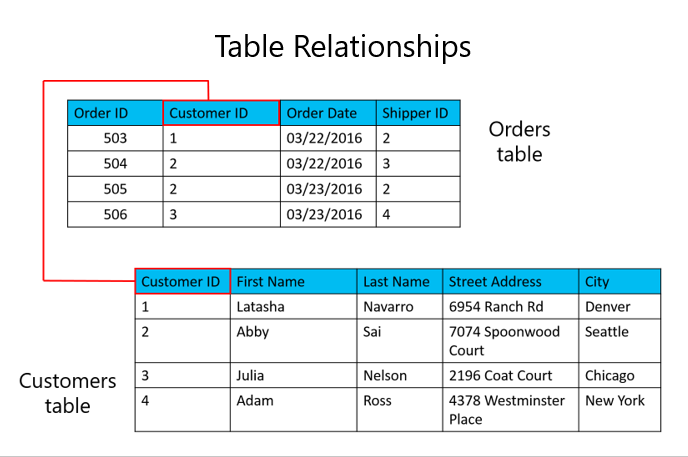

## Módulo 1: Fundamentos y conceptos clave

- **Fundamentos de datos relacionales (SQL) y no relacionales (NoSQL)**
  - Se transmitió el: miércoles 02 de Octubre a las 20:00  
  - [Ver grabación](https://codigofacilito.com/videos/introduccion-fundamentos-de-datos-relacionales-sql-y-no-relacionales-nosql)

# Temario

## 1. ¿Qué es una base de datos?

- Una base de datos es un almacén organizado de datos para:
  - Recuperar datos más rápidamente
  
- Las bases de datos suelen almacenar datos de una manera que **minimiza la redundancia** (es decir evitar guardar informacion repetida, por eso se suelen usar datos relacionales) para lograr:
  - Almacenamiento de datos más eficiente
  - Reducción de la inconsistencia de los datos
  
- Los lenguajes de consulta proporcionan una forma estandarizada de acceder a los datos de una base de datos. (Por ejemplo SQL)
  
- Un **sistema de gestión de bases de datos (DBMS)** es el **software** con el que puede crear y gestionar bases de datos

### Tenemos diferentes bases de datos

- Bases de datos SQL (Structured Query Language):
  - **Relacional** (SQL Server, MySQL, Posgrest, Oracle)
- Bases de datos NoSQL (Not Only SQL)
  - Clave-Valor
  - Documental
  - Grafos

## 2. Fundamentos de bases de datos relacionales

- Las entidades se representan como **relaciones** (**tablas**), en las que sus atributos se representan como **dominios** (**columnas**).

- La mayoría de las bases de datos relacionales están normalizadas, con relaciones definidas entre tablas a través de claves primarias y externas.

### Tablas en bases de datos relacionales

## 3. Demostración: Exploración de una base de datos relacional
Acá podemos utilizar Microsoft SQL Server Magnament Studio

### Microsoft SQL Server y SQL Server Management Studio (SSMS)

Para utilizar SQL Server Management Studio (SSMS) necesitas tener instalado Microsoft SQL Server. SQL Server proporciona la infraestructura y los servicios necesarios para gestionar y almacenar datos, mientras que SSMS ofrece la interfaz gráfica de usuario para interactuar con SQL Server.

**Microsoft SQL Server** (Este es el DBMS pero con datos Relacionales): 
- Un RDBMS (Relational Database Management System o Sistema de gestión de bases de datos relacional): que se instala en Windows y permite gestionar y crear tus bases de datos.
- Funciona como un servicio, similar a los que se ven en el Administrador de tareas de Windows.

**SQL Server Management Studio (SSMS)**:
- Una herramienta que se instala en Windows y te permite administrar y crear tus bases de datos a través de una interfaz gráfica de usuario.
- SSMS se utiliza para interactuar con Microsoft SQL Server de manera visual, facilitando la administración y gestión de bases de datos.

*El término "SQL Server" es simplemente una forma abreviada y comúnmente utilizada para referirse a "Microsoft SQL Server."*

## 4. Bases de datos NoSQL (Not Only SQL)

- **No utilizan** el modelo de **datos relacionales**
- Ofrecen un **mejor rendimiento** que las bases de datos relacionales **para volúmenes muy grandes** de datos complejos
- Algunas bases de datos NoSQL carecen de características relacionales clave
  
- Cada vez mayor uso de las bases de datos NoSQL debido a:
  - Necesidad de almacenar y gestionar **grandes volúmenes de datos**
  - Mayor disponibilidad de tecnologías de escalabilidad horizontal
  
- Las bases de datos NoSQL, también conocidas como "no solo SQL", **almacenan datos en un formato diferente al de las tablas relacionales**. Se pueden consultar mediante API de lenguaje natural, lenguajes de consulta estructurados declarativos, y lenguajes de consulta mediante ejemplo.

### Los tipos más comunes de bases de datos NoSQL son:
- Clave-valor
- Documento
- Columnas
- Grafo

### Bases de datos NoSQL más reconocidas
- **CosmosDB**
- MongoDB
- Apache Cassandra
- CouchBase
- Redis
- Neo4j

## 5. Introducción a la normalización
## 6. Formas de normalización
### De la primera a la tercera forma normal
## 7. Demostración: Normalización de una tabla de ejemplo
## 8. Introducción a las sentencias de consulta

