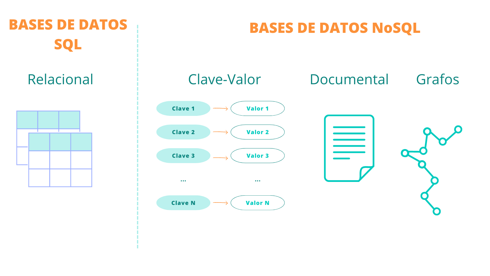
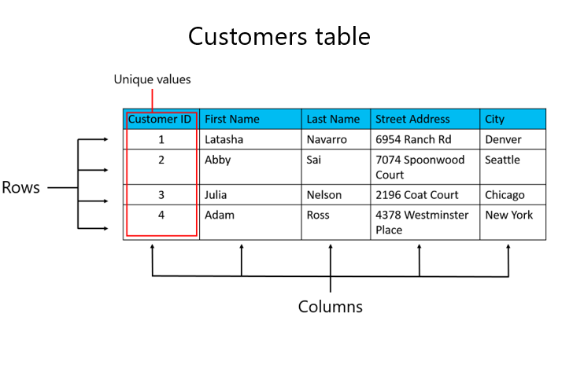
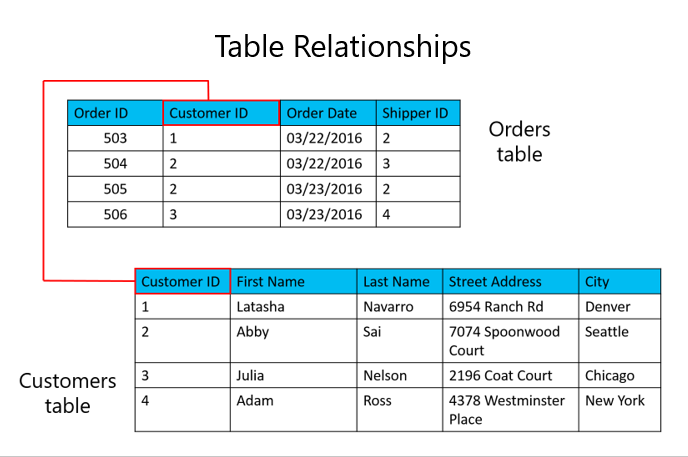

# Módulo 1: Fundamentos y conceptos clave

## Clase 2

## - **Fundamentos de datos relacionales (SQL) y no relacionales (NoSQL)**
  - Se transmitió el: miércoles 02 de Octubre a las 20:00  
  - [Ver grabación](https://codigofacilito.com/videos/introduccion-fundamentos-de-datos-relacionales-sql-y-no-relacionales-nosql)


# Temario

## - [1) ¿Qué es una base de datos?](#01-qué-es-una-base-de-datos)
## - [2) Fundamentos de Bases de Datos Relacionales SQL](#02-fundamentos-de-bases-de-datos-relacionales-sql)
## - [3) Demostración: Exploración de una base de datos relacional](#03-demostración-exploración-de-una-base-de-datos-relacional)
## - [4) Bases de datos NoSQL](#04-bases-de-datos-nosql)
## - [5) Introducción a la normalización](#05-introducción-a-la-normalización)
## - [6) Formas de normalización](#06-formas-de-normalización)
   - De la primera a la tercera forma normal
## - [7) Demostración: Normalización de una tabla de ejemplo](#07-demostración-normalización-de-una-tabla-de-ejemplo)
## - [8) Introducción a las sentencias de consulta](#08-introducción-a-las-sentencias-de-consulta)


---


# 01-Qué es una base de datos?

 Una base de datos es un almacén organizado de datos para **recuperar datos más rápidamente**
  
  Las bases de datos suelen almacenar datos de una manera que **minimiza la redundancia** (es decir evitar guardar informacion repetida, por eso se suelen usar datos relacionales) para lograr:
  - Almacenamiento de datos más eficiente
  - Reducción de la inconsistencia de los datos
  
- Los lenguajes de consulta proporcionan una forma estandarizada de acceder a los datos de una base de datos. (Por ejemplo SQL)
  
- Un **sistema de gestión de bases de datos (DBMS)** es el **software** con el que puede crear y gestionar bases de datos


## Tenemos diferentes bases de datos

- Bases de datos SQL (Structured Query Language):
  - **Relacional** (SQL Server, MySQL, Posgrest, Oracle)
- Bases de datos NoSQL (Not Only SQL)
  - Clave-Valor
  - Documental
  - Grafos




---

# 02-Fundamentos de Bases de Datos Relacionales SQL 

  Las entidades se representan como **relaciones** (**tablas**), en las que sus atributos se representan como **dominios** (**columnas**).

  La mayoría de las bases de datos relacionales están normalizadas, con relaciones definidas entre tablas a través de claves primarias y externas.



### Tablas en bases de datos relacionales




# 03-Demostración: Exploración de una base de datos relacional
Acá vimos un ejemplo hecho en Microsoft SQL Server Magnament Studio 


### Microsoft SQL Server y SQL Server Management Studio (SSMS)

Para utilizar SQL Server Management Studio (SSMS) necesitas tener instalado Microsoft SQL Server. SQL Server proporciona la infraestructura y los servicios necesarios para gestionar y almacenar datos, mientras que SSMS ofrece la interfaz gráfica de usuario para interactuar con SQL Server.

**Microsoft SQL Server** (Este es el DBMS pero con datos Relacionales): 
- Funciona como un servicio, similar a los que se ven en el Administrador de tareas de Windows.
- Microsoft SQL Server es un RDBMS (Relational Database Management System o **Sistema de gestión de bases de datos relacional**): que se instala en Windows y permite gestionar y crear tus bases de datos.

**SQL Server Management Studio (SSMS)**:
- SQL Server Management Studio es una herramienta (un software) que se instala en Windows y te permite administrar y crear tus bases de datos a través de una interfaz gráfica de usuario.
- SSMS se utiliza para interactuar con Microsoft SQL Server de manera visual, facilitando la administración y gestión de bases de datos.

*El término "SQL Server" es simplemente una forma abreviada y comúnmente utilizada para referirse a "Microsoft SQL Server."*

---

# 04-Bases de datos NoSQL (Not Only SQL)

 **No utilizan** el modelo de **datos relacionales**. 

 Ofrecen un **mejor rendimiento** que las bases de datos relacionales **para volúmenes muy grandes** de datos complejos.

 Algunas bases de datos NoSQL carecen de características relacionales clave
  
  Cada vez mayor uso de las bases de datos NoSQL debido a:
  - Necesidad de almacenar y gestionar **grandes volúmenes de datos**
  - Mayor disponibilidad de tecnologías de escalabilidad horizontal
  
  Las bases de datos NoSQL, también conocidas como "no solo SQL", **almacenan datos en un formato diferente al de las tablas relacionales**. Se pueden consultar mediante API de lenguaje natural, lenguajes de consulta estructurados declarativos, y lenguajes de consulta mediante ejemplo.


### Los tipos más comunes de bases de datos NoSQL son:
- Clave-valor
- Documento
- Columnas
- Grafo


### Bases de datos NoSQL más reconocidas
- **CosmosDB**
- MongoDB
- Apache Cassandra
- CouchBase
- CouchDB
- Redis
- Neo4j

---

# 05-Introducción a la normalización

  La normalización de bases de datos es un proceso que consiste en organizar los datos de una base de datos para reducir la redundancia y eliminar problemas en el almacenamiento y recuperación de información.

  La normalización de bases de datos implica:
  - Crear tablas
  - Establecer relaciones entre las tablas
  - Eliminar grupos repetitivos de las tablas
  - Crear una tabla separada por cada grupo de datos relacionados
  - Identificar cada grupo de datos relacionados con una clave primaria


  La normalización de bases de datos es un paso crucial en el diseño de sistemas de gestión de bases de datos. Mejora la eficiencia de la base de datos, facilita la gestión y la toma de decisiones.


# 06-Formas de normalización

  Hay algunas reglas en la normalización de una base de datos. Cada regla se llama "forma normal".

  Si se cumple la primera regla, se dice que la base de datos está en "primera forma normal".

  Si se observan las tres primeras reglas, se considera que la base de datos está en "tercera forma normal".

  Aunque son posibles otros niveles de normalización, la tercera forma normal se considera el nivel más alto necesario para la mayoría de las aplicaciones.


### Primera forma normal
(En resumen para mi es juntar columnas que hagan lo mismo, en una sola)
- Elimine los grupos repetidos de las tablas individuales.
- Cree una tabla independiente para cada conjunto de datos relacionados.
- Identifique cada conjunto de datos relacionados con una clave principal.
  

### Segunda forma normal
(En resumen es juntar filas repetidas en una sola tabla aparte)
- Eliminar datos redundantes
- Cree tablas independientes para conjuntos de valores que se apliquen a varios registros.
- Relacione estas tablas con una clave externa.

### Tercera forma normal

- Eliminar los campos que no dependen de la clave. (Y lo mandamos a otra tabla si es necesario)

*Al igual que con otras muchas reglas y especificaciones formales, los escenarios del mundo real no siempre permiten un cumplimiento perfecto. En general, la normalización requiere tablas adicionales y algunos clientes consideran esto un trabajo considerable. Si decide infringir una de las tres primeras reglas de la normalización, asegúrese de que su aplicación se anticipe a los problemas que puedan aparecer, como la existencia de datos redundantes y de dependencias incoherentes.*


# 07-Demostración: Normalización de una tabla de ejemplo 
Acá vimos un ejemplo en que esta en el excel

---


# 08-Introducción a las sentencias de consulta

## Lenguaje de consulta estructurado | SQL

### Lenguaje de consulta estructurado
- En inglés SQL es _"Structured Query Language"_.
- Desarrollado por IBM en la década de 1970.
- Adoptado como estándar por los organismos de normalización ANSI e ISO.
- Ampliamente utilizado en la industria.

### La implementación de Microsoft es Transact-SQL
- Conocido como T-SQL.
- Lenguaje de consulta para **SQL Server** y **Azure SQL Database**.

### SQL es declarativo, no procedimental
- Describe lo que quieres, no especifica pasos.


# La sentencia SELECT

| Elemento   | Expresión          | Rol                                 |
|------------|--------------------|-------------------------------------|
| SELECT     | `<selectlist>`     | Define qué columnas devolver        |
| FROM       | `<table source>`   | Define la(s) tabla(s) a consultar   |
| WHERE      | `<searchcondition>`| Filtra filas usando un predicado    |
| GROUP BY   | `<groupbylist>`    | Organiza filas por grupos           |
| HAVING     | `<searchcondition>`| Filtra grupos usando un predicado   |
| ORDER BY   | `<orderbylist>`    | Ordena la salida                    |

### Ejemplo de consulta
```sql
SELECT OrderDate, COUNT(OrderID)
FROM Sales.SalesOrder
WHERE Status = 'Shipped'
GROUP BY OrderDate
HAVING COUNT(OrderID) > 1
ORDER BY OrderDate DESC;
```


# Ejemplos básicos de consultas SELECT

- Todas las columnas:
```sql
  SELECT * FROM Production.Product;
```

- Columnas en específico:
```sql
SELECT Name, ListPrice
FROM Production.Product;
```

- Expresiones y Alias:
```sql
SELECT Name AS Product, ListPrice * 0.9 AS SalePrice
FROM Production.Product;
```


# Consultas NoSQL

No utilizaremos SQL para escribir consultas en No SQL.

No es relacional, pero nos brinda una forma organizada de almacenar datos.

Los datos se almacenan en forma de documentos en lugar de en forma de tabla.

El mejor ejemplo de NoSQL es Mongo DB.

En SQL, utilizaremos el término pares clave-valor, pero en Mongo DB, utilizaremos pares campo-valor.

Los documentos se almacenan y el grupo de documentos se denomina "Colección".

El documento estará en formato JSON.

Los datos se denominan "Documento" y la colección de documentos se denomina "Colección".


# Ejemplo consulta NoSQL (JSON)

```json
{
  "object": "String",
  "q": "Expression",
  "fields": "ArrayofString",
  "groupBy": "ArrayofString",
  "aggregation": "Object mapping fields to aggregate functions"
}

{
  "object": "employees",
  "q": {
    "position": "Sales Manager"
  },
  "fields": ["name", "salary"]
}

```

# Referencias

- [Descripción de la normalización de la base de datos - Microsoft 365 Apps | Microsoft Learn](https://learn.microsoft.com/)
- [Bases de datos NoSQL: qué son, tipos y ventajas | Blog de Arsys](https://www.arsys.es/blog)
- [Bases de datos NoSQL: Qué son, tipos y ventajas | OriginSoftware Blog (originsw.com)](https://www.originsw.com)
- [Consultas NoSQL - Azure Cosmos DB for NoSQL | Microsoft Learn](https://learn.microsoft.com/)
- [NoSQL Query Language - Backand Documentation (backand-docs.readthedocs.io)](https://backand-docs.readthedocs.io/)


