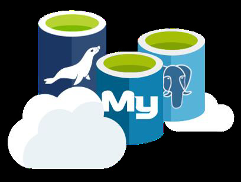
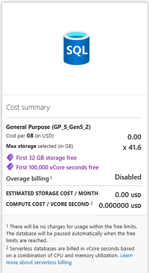
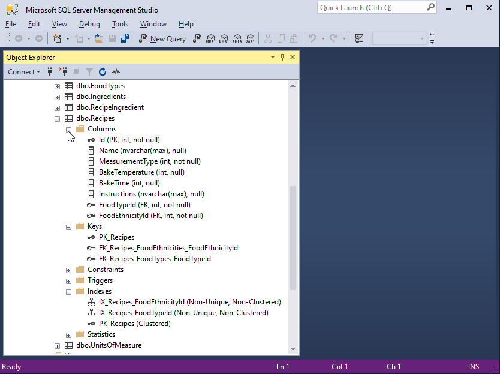
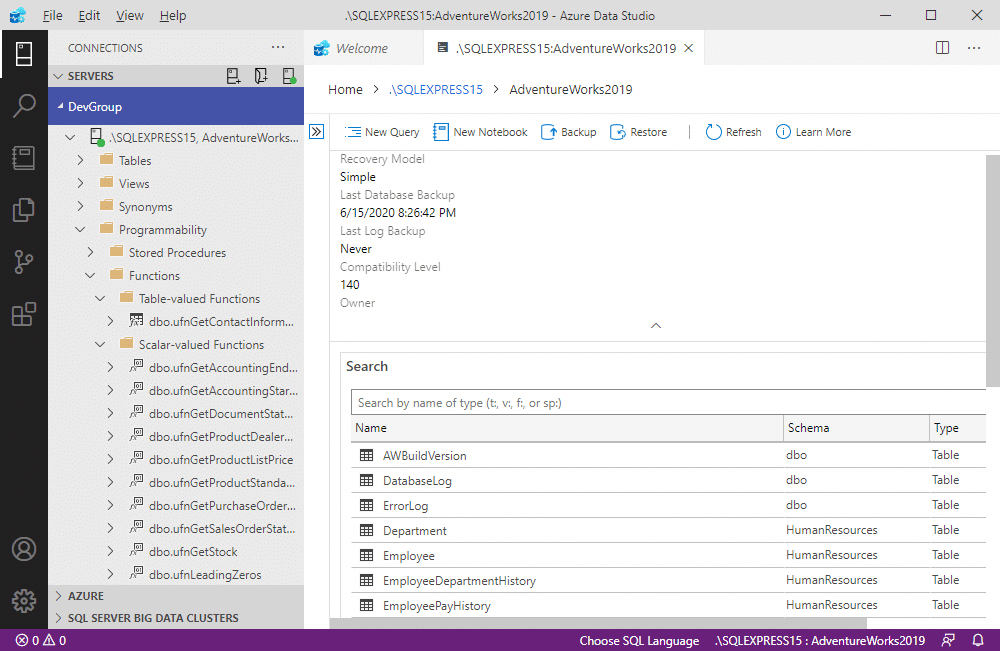
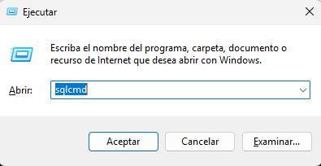
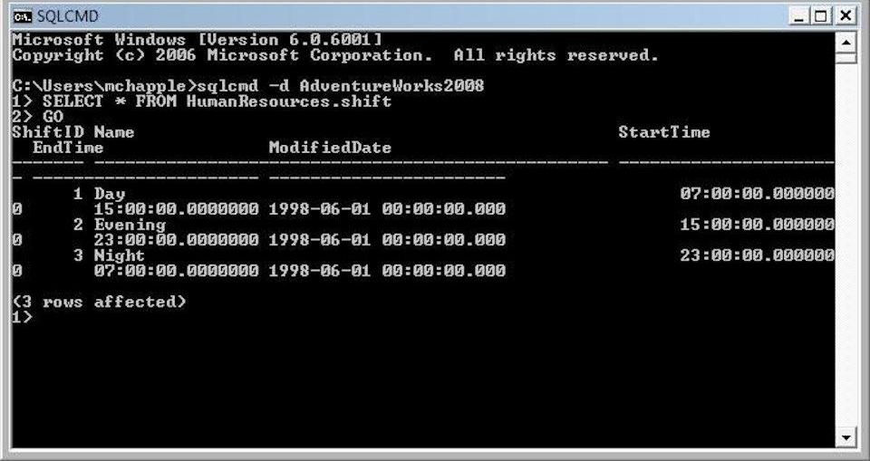

# Módulo 2: Datos relacionales en Azure

## Clase 3

## **Servicios de bases de datos relacionales en Azure, implementación, conexión,consultas y herramientas**
  - Se transmitió el: viernes 04 de Octubre a las 20:00 
  - [Ver grabación](https://codigofacilito.com/videos/introduccion-bases-de-datos-con-azure)

# Temario

- **Exploración e implementación de Azure SQL** (servidor y base de datos).
- **Servicios de bases de datos open-source** (MySQL, PostgreSQL).
- **Uso de herramientas de conexión y consulta**:
  - Azure Data Studio.
  - SQL Server Management Studio.
  - sqlcmd.

---

# Azure SQL

## SQL Server en Azure

- **Virtual Machines**  
  Ideal para *lift & shift* y/o cargas de trabajo que requieren acceso a nivel de sistema operativo.  
  Tipo: **Infrastructure-as-a-Service**.
  Puede funcionar en Windows y en Linux

## Azure SQL Database

- Ideal para respaldar aplicaciones en la nube modernas.
- Tipo: **Platform-as-a-Service**.

## Azure SQL Managed Instance

- Ideal para modernizar aplicaciones existentes.  
  Tipo: **Platform-as-a-Service**.

Azure es la nube que mejor conoce SQL Server.

---

# Azure Database for MySQL, PostgreSQL & MariaDB

Las bases de datos de Azure para MySQL, PostgreSQL y MariaDB ofrecen versiones comunitarias totalmente administradas y listas para la empresa de las populares bases de datos OSS.

## Características principales:
- **Servicios integrados de Azure**.
- **Completamente gestionado**.
- **Segura y compatible**.
- **El mejor costo total de propiedad**.
- **Inteligencia incorporada**.
- **Escalabilidad inigualable**.

---

# Opciones de implementación para Azure SQL

## SQL Server on Azure Virtual Machines

- **SQL Virtual Machine**:
  - Acceso a servidores de sistemas operativos y SQL Server.
  - Compatibilidad amplia con versiones de sistemas operativos y SQL.
  - Funciones de administración automatizadas para SQL Server.

## Azure SQL Database

- **Single Database**:
  - Almacenamiento a gran escala (hasta 100 TB).
  - Computación sin servidor.
  - Servicio totalmente administrado.
- **Elastic Pool**:
  - Uso compartido de recursos entre múltiples bases de datos para optimizar los precios.
  - Gestión simplificada del rendimiento para múltiples bases de datos.
  - Servicio totalmente administrado.

## Azure SQL Managed Instance

- **Single Instance**:
  - Amplia área de superficie de SQL Server (gran mayoría).
  - Compatibilidad con red virtual nativa.
  - Servicio totalmente administrado.
- **Instance Pool**:
  - Aprovisionamiento previo de recursos informáticos para la migración.
  - Permite una migración rentable.
  - Capacidad para alojar instancias más pequeñas (2 Vcore).

---

# Opciones flexibles de computación y almacenamiento

## Modelo DTU
- **Sencillo, preconfigurado.**
- 
## Unidad preempaquetada y empaquetada
- Representa la potencia de la base de datos.
- Diseñada para un rendimiento predecible, pero algo inflexible y limitada en opciones.
- El tamaño de la DTU ofrece simplicidad de elección.

## Modelo vCore
- **Escalabilidad independiente.**

Este modelo le permite:
- Elegir de forma independiente los recursos de computación y almacenamiento.
- Utilizar **Azure Hybrid Benefit** para **SQL Server** y así ahorrar costos.
- Es ideal para clientes que valoran:
  - **La flexibilidad.**
  - **El control.**
  - **La transparencia.**

# Paga solo por lo que necesitas (Azure SQL)

## Tenemos 2 Modelos de servicio:

## 1) DTUs
*En este modelo se podría decir que se comparten los recursos para abaratar costos*

- **Basic**: Bases de datos pequeñas, especialmente aquellas en fases de desarrollo.
- **Standard**: Bases de datos de propósito general con requisitos de rendimiento moderados.
- **Premium**: Bases de datos de misión crítica con requisitos de alto rendimiento y alta disponibilidad.

Una de las características de este modelo se puede seleccionar el tamaño máximo de la base de datos (con un selector deslizable. Por ej: 1 o 2 GB maxímo en el Básico, sea 1 o 2 no incide en el costo pero cobra por hora)

## 2) vCores
- **General Purpose (Uso general o Propósito general)**: Aplicaciones de datos con requisitos básicos de E/S y disponibilidad.
- **Business Critical (Crucial para la empresa)**: Aplicaciones de datos críticos para el negocio con alta disponibilidad y E/S rápidas.
- **Hyperscale (Hiperescala)**: Cargas de trabajo OLTP y HTAP de VLDB con:
  - Requisitos de escala de lectura.
  - Almacenamiento altamente escalable.

### Escalabilidad elástica y rendimiento
- Tres niveles de servicio dentro del modelo basado en DTU y dos niveles dentro del modelo basado en vCorele permiten **escalar hacia arriba y hacia abajo según las necesidades de rendimiento** y ofrecen un mejor aislamiento de recursos y una experiencia de facturación mejorada.

### Continuidad de negocio y protección de datos
- Un espectro de funciones de continuidad empresarial en todos los niveles permite:
  - **Mayor control** sobre:
    - La recuperación de datos.
    - La conmutación por error.

### Familiar y totalmente gestionado
- Compatibilidad casi completa con **SQL Server**.
- Proporciona eficiencias significativas al escalar aplicaciones.
- Ofrece:
  - Un servicio de mantenimiento casi nulo.
  - Una variedad de herramientas de administración y API programáticas familiares.

---

# Azure SQL Database Gratis (Vista Previa)

 

## Límites gratis mensuales
- Es una base de datos de tipo **PaaS** (Platform as a Service).
- Totalmente administrada, con funciones como:
  - Actualizar.
  - Aplicar revisiones.
  - Crear copias de seguridad.
  - Supervisar sin intervención del usuario.
- Los límites gratuitos mensuales incluyen:
  - **100,000 segundos** de núcleo virtual en modalidad **serverless**.
  - Un tamaño máximo de **32 GB de datos**.

---

# Demostración: Creando Servicios de Bases de Datos (Con una Virtual Machine)

## Pasos para crear los servicios
1. **Crear un grupo de recursos**:
   - Incluye una **Virtual Machine** para realizar las prácticas.

2. **Costos de servicios**:
   - Hay que pagar dos servicios por separado:
     - **Servicio de cómputo.**
     - **Servicio de almacenamiento.**

3. **Configuración básica**:
   - Elegir la versión de **SQL Server**.
   - Seleccionar el sistema operativo:
     - Windows.
     - Ubuntu.
     - Linux, etc.

4. **Configuración de la familia**:
   - Elegir una familia con características específicas como:
     - Núcleos **vCPUs**.
     - Cantidad de **RAM**.
   - Estas configuraciones pertenecen a familias como:
     - **B-series.**
     - **D-series.**
   - Cada conjunto tiene su precio asociado.

5. **Se debe colocar Username y Password**

6. **Selección de almacenamiento**:
   - Elegir el tipo de almacenamiento para el sistema operativo:
   - **SSD** o **HDD** y la capacidad del disco 128GB por ejemplo

7. **Se crea una red Network con una ip interna**

8. **Se elige a que hora se apaga la maquina, email** 
   
9.  **Se se selecciona: The enable with managed storage account (recommended)**

**Se selecciona la opción "Habilitar con cuenta de almacenamiento administrado (recomendado)"**

10. **Se puede ejecutar un script automático**
    
11. **Se elige el almacenamiento de la base de datos** , velocidad y capacidad. Ej: Premium SSD 1024GB , un tera es el default, se deberia ajustar y revisar.

---

# Demostración: Creando Servicios de Bases de Datos (Con una SQL Database)

## Pasos para crear los servicios

1. Elegimos **SQL Database crear**.  
2. Por **default** nos ofrece crear la base de datos **serverless** (con servidor **on demand** cuando se la necesita) gratuita.  
3. Nos pide la **suscripción** y el **grupo de recursos**.  
4. Especificamos el **nombre de la base de datos** y, lo más importante, el **nombre del servidor**, que lo podemos crear **antes** o en ese momento.  
5. Elegimos si queremos **grupo elástico**.  
6. Está en **Hyperscale** (**Highly scalable compute and storage**) o (**Cómputo y almacenamiento altamente escalables**).  
   En esta parte elegimos si modelo con **DTU** (**Basic**, **Standard**, **Premium**) o modelo **vCore** (**General Purpose**, **Business Critical**, **Hyperscale**).  
7. Luego podemos elegir **Provisionado** (por hora con **vCores configurados**) o **Serverless** (por segundo con **vCores usados**).  
8. Ahí podemos con una **barrita deslizable** seleccionar más o menos **vCores**.  
9. Y tenemos una opción de **Auto-pause delay**, que si está inactiva por cierto periodo se pausa, para **minimizar los gastos**. Contiene un **calendario** con día, horas y minutos.  
10. Por último, definimos el **tamaño máximo en GB** de la base de datos.  
11. Elegimos el **método de conectividad**: **end point público**, **privado** o **no access**.  
    - En esta parte, podemos seleccionar que cualquier servicio de **Azure** se conecte a este **server**.  
12. Podemos habilitar el **Microsoft Defender**, que tiene un **costo**.  
13. Aquí encontramos algo interesante: podemos elegir **sample** para que nos cree una base de datos de ejemplo para "**jugar**".  
14. Aca tambien podemos seleccionar si tenemos algun archivo respaldo.
15. Las siglas **SQL_Latin1_GENERAL_CP1_CI_AS** nos sirven para determinar el formato de la base de datos, conocido como **Database Collation**.  
    - **AS**: Significa *"As sensitive"*, es decir, que es sensible a las mayúsculas.  
    - **Collation**: Define cómo se almacenan y comparan los datos en la base de datos.
16. Por ultimo crear.

---

# Herramientas para conectarme

## SSMS - SQL Server Managnament Studio
- Tiene parte grafica para poder ver las tablas, relaciones , etc

## Azure Data Studio
  - Es mas simple
  - Tiene extensiones como Visual Studio Code
  - No tiene parte grafica
  

## sqlcmd
- Administra la base de datos por linea de comandos
- Se pueden hacer consultas
  

