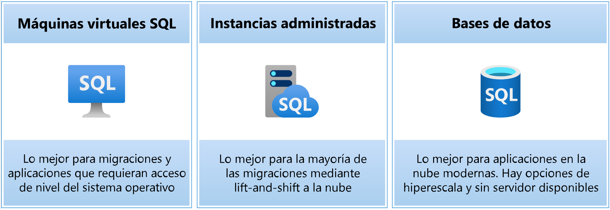
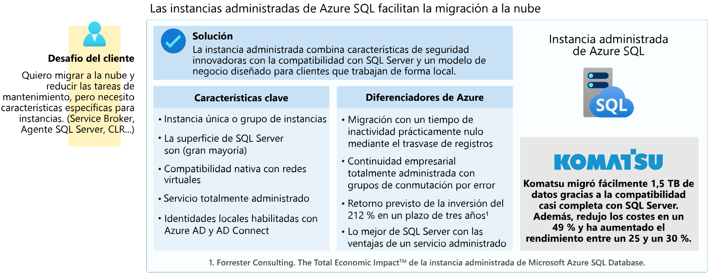
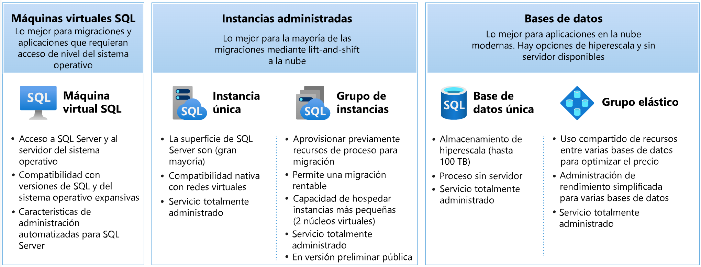

# Módulo 2: Datos relacionales en Azure

## Clase 4

## **Exploración práctica de Azure SQL, SQL Managed Instance y SQL Server en MáquinaVirtual**
  - Se transmitió el: miércoles 09 de Octubre a las 20:00
  - [Ver grabación](https://codigofacilito.com/videos/introduccion-exploracion-practica-de-azure-sql-sql-managed-instance-y-sql-server-en-maquinavirtual)

## Objetivos de la clase/Introducción Hoy nos adentraremos de forma práctica en las tres formas principales de utilizar SQL Server en Azure.

# Tabla de contenido - Clase #4

1. **Introducción a Azure SQL en la nube**
   - Breve introducción.

2. **Azure SQL Database**
   - La forma más popular de acceder a tus datos en la nube.

3. **SQL Managed Instance**
   - Acceso a características con ámbito de instancia sin necesidad de rediseño.

4. **SQL Server en Máquina Virtual**
   - La extensión del mundo on-premise, combinando dos recursos de la nube.

---

# 1-Azure SQL en la nube

## Por que Azure SQL?

Azure SQL es una oferta de base de datos en la nube que Microsoft proporciona como parte de la plataforma de informática en la nube Azure. A diferencia de otras ediciones de SQL Server, no es necesario aprovisionar hardware, instalar, o aplicar revisiones; Microsoft se encarga de mantener la plataforma por usted.

Tampoco se necesita diseñar una instalación de base de datos para garantizar la escalabilidad, la alta disponibilidad o la recuperación ante desastres, ya que el servicio proporciona automáticamente estas funciones.

Toda aplicación que use Azure SQL debe tener acceso a Internet para conectarse a la base de datos.

                                    - Microsoft, 2010

## Opciones de implementacion de Azure SQL

### 1) Máquinas virtuales SQL
- Lo mejor para migraciones y aplicaciones que requieran acceso de nivel del sistema operativo.

### 2) Instancias administradas
- Lo mejor para la mayoría de las migraciones mediante lift-and-shift a la nube.

> *Lift-and-shift: Estrategia de migración que consiste en mover una aplicación o sistema tal como está (sin modificaciones significativas) desde su entorno original a la nube. Es un enfoque rápido y directo para trasladar cargas de trabajo sin rediseñar la arquitectura de la aplicación.*

### 3) Bases de datos SQL
- Lo mejor para aplicaciones en la nube modernas. Hay opciones de hiperescala y sin servidor disponibles.

---

# 2-Azure SQL Database

Definición , Caso de Uso, Demo

## Definición: Azure SQL Database

- **Azure SQL Database** es una opción de implementación de PaaS (Platform as a Service) de Azure SQL que abstrae de los usuarios tanto el sistema operativo como la instancia de SQL Server.
- Permite obtener una base de datos y empezar a desarrollar aplicaciones de forma muy simple.
- Es la única opción de implementación que **admite escenarios en los que se necesita almacenamiento de base de datos ilimitado y escalado automático** para cargas de trabajo imprevisibles.
- Cuenta con el **SLA** de mayor disponibilidad del sector.
- Ofrece acceso a funciones inteligentes, como supervisión y rendimiento.

## Caso de uso: Azure SQL Database

### Introducción
Azure SQL Database se ha creado para aplicaciones modernas en la nube.

### Desafío del Cliente
"Quiero crear aplicaciones modernas, potencialmente con varios inquilinos, con la mayor cantidad de tiempo de actividad y con un rendimiento predecible."

### Solución
Azure SQL Database es un servicio de base de datos en la nube altamente escalable, con alta disponibilidad integrada y aprendizaje automático.

### Características Clave
- Base de datos única o grupo elástico.
- Almacenamiento de hiperescala (más de 100 TB).
- Proceso sin servidor.
- Servicio totalmente administrado.
- Compatibilidad con vínculos privados.
- Alta disponibilidad con aislamiento de zona de disponibilidad.

### Diferenciadores de Azure
- Disponibilidad más alta del sector con un Acuerdo de Nivel de Servicio (SLA) del 99,995%.
- Único SLA de continuidad empresarial del sector con un RPO de 5 segundos y un RTO de 30 segundos.
- Líder en relación rendimiento-precio para cargas de trabajo críticas, con un precio un 86% inferior al de AWS RDS (según GigaOm).

### Caso de Uso: AccuWeather
AccuWeather utiliza bases de datos de Azure SQL para proporcionar un servicio de predicción meteorológica automatizado y escalable.

  

## Demo Azure SQL Database

### Paso a Paso SQL Database

1. **Abrimos Azure portal**.
2. **Elegimos Azure SQL Database del Marketplace** (ícono de la bolsita).
3. Se presentan **3 opciones**:
   - **SQL Database**.
   - **Instancias administradas de SQL**.
   - **Máquinas virtuales de SQL**.
4. **Seleccionamos SQL Database** y luego elegimos **Base de datos única**. Creamos el servidor junto a la base de datos.
5. Aunque se ofrece el servidor gratuito *Serverless* (100.000 vCore segundos y 32GB Backup), **crearemos nuestro propio servidor**.
6. **Seleccionamos una suscripción** y **creamos un grupo de recursos**.
7. Asignamos un **nombre a nuestra base de datos**.
8. Seleccionamos el servidor. Si no existe uno, seleccionamos **Crear nuevo**. Definimos:
   - **Ubicación**.
   - **Modo de autenticación**: **Microsoft Entra** o **SQL clásico** (usuario y contraseña).
9. Decidimos si queremos un **grupo elástico**.
10. Dejamos la **carga de trabajo en pruebas** para implementar.
11. En **proceso y almacenamiento** elegimos las características:
    - **Modelo DTU**:
      - Básico.
      - Estándar.
      - Premium.
    - **Modelo vCore**:
      - Propósito General.
      - Business Critical.
      - Hiperescala.
12. Definimos el **nivel de proceso**:
    - **Aprovisionado**: recursos preasignados (facturación por hora según núcleos virtuales configurados).
    - **Sin servidor**: escala automática (facturación por segundo según núcleos virtuales usados).
13. Seleccionamos si queremos **almacenamiento de copia de seguridad por zona o geografía**.
14. Configuramos la **red**:
    - **Sin acceso**: nadie puede conectarse.
    - **Punto de conexión público**: permite que:
        - Los recursos de Azure accedan al servidor.
        - Agregar la dirección IP del cliente actual (nuestra IP para acceder).
    - **Punto de conexión privado**: restringido a ciertos recursos.
15. **Directiva de conexión**: predeterminado, manejado por Azure.
16. Seleccionamos **conexiones cifradas** (se recomienda **TLS 1.2**).
17. Podemos agregar **Microsoft Defender para SQL** (servicio opcional con costo).
18. Activar el **libro de contabilidad** para validar la integridad de la información.
19. En **configuración adicional**:
    - Seleccionamos el **origen de los datos** (marcar **Base de datos de muestra** para pruebas).
20. Configuramos la **collation** (juego de caracteres):
    - Por ejemplo, **SQL_Latin1_GENERAL_CP1_CI_AS** (*CI*: insensible a mayúsculas; *AS*: sensible a mayúsculas).
21. Finalmente, **Revisar y crear** → **Crear**.

22. Usando **Magnament Studio** o el **Data Studio** colocamos el nombre del servidor que esta en Azure portal en nuestra sql database creada y buscamos donde dice host ( es una direccion larga sqlmi-cf435346345.database.windows.net por ejemplo), marcamos el método de autenticacion y colocamos usuario y contraseña. Y realizamos consultas para probar

*TLS (Transport Layer Security / Seguridad de la Capa de Transporte): Protocolo de seguridad que cifra las conexiones para proteger datos en tránsito entre el cliente y el servidor, recomendado en Azure SQL para garantizar comunicaciones seguras*

---

# 3-SQL Managed Instance (Instancia administrada)

Definición , Caso de Uso, Demo

## Definición: SQL Managed Instance

- **SQL Managed Instance** es una opción de implementación PaaS (Platform as a Service) de Azure SQL.
- Ofrece una instancia de SQL Server, pero elimina gran parte de la sobrecarga que supone la administración de una máquina virtual (VM).
- La mayoría de las funciones disponibles en SQL Server también están disponibles en SQL Managed Instance.
- Esta opción es idónea para clientes que desean usar características con ámbito de instancia y migrar a Azure sin tener que rediseñar sus aplicaciones.
- **Acceso a funciones adicionales**:
  - Agente SQL Server.
  - Service Broker.
  - Common Language Runtime (CLR).
  - Correo electrónico de base de datos.
  - Servidores vinculados.
  - Transacciones distribuidas.
  - Machine Learning Services.

## Caso de uso: SQL Managed Instance

### Introducción
Las instancias administradas de Azure SQL facilitan la migración a la nube.

### Desafío del Cliente
"Quiero migrar a la nube y reducir las tareas de mantenimiento, pero necesito características específicas para instancias (Service Broker, Agente SQL Server, CLR...)."

### Solución
La instancia administrada combina características de seguridad innovadoras con la compatibilidad con SQL Server y un modelo de negocio diseñado para clientes que trabajan de forma local.

### Características Clave
- Instancia única o grupo de instancias.
- La superficie de SQL Server (gran mayoría).
- Compatibilidad nativa con redes virtuales.
- Servicio totalmente administrado.
- Identidades locales habilitadas con Azure AD y AD Connect.

### Diferenciadores de Azure
- Migración con un tiempo de inactividad prácticamente nulo mediante el trasvase de registros.
- Continuidad empresarial totalmente administrada con grupos de conmutación por error.
- Retorno previsto de la inversión del 212% en un plazo de tres años¹.
- Lo mejor de SQL Server con las ventajas de un servicio administrado.

### Caso de Uso: Komatsu
Komatsu migró fácilmente 1,5 TB de datos gracias a la compatibilidad casi completa con SQL Server. Además:
- Redujo los costes en un 49%.
- Aumentó el rendimiento entre un 25% y un 30%.

1 _Forrester Consulting. The Total Economic Impact™ de la instancia administrada de Microsoft Azure SQL Database._

*Service Broker se refiere a mensajes que llegan y se tienen que administrar*

## Demo Azure SQL Managed Instance

*Aca primero se crea el Managed Instance y luego el servidor.*

### Paso a paso SQL Managed Instance

1. **Abrimos Azure portal**.
2. **Elegimos Azure SQL Database del Marketplace** (ícono de la bolsita).
3. Se presentan **3 opciones**:
   - **SQL Database**.
   - **Instancias administradas de SQL**.
   - **Máquinas virtuales de SQL**.
4. **Elegimos Instancias administradas de SQL (SQL Managed Instance)**.
5. **Seleccionamos el grupo de recursos** (puede ser el mismo que del SQL Database).
6. **Seleccionamos la región**.
7. **Opcional:** Seleccionamos un grupo de instancias (*Instance Pool*).
8. En **proceso y almacenamiento**, seleccionamos la **carga de trabajo**.
9. Nivel de servicio:
   - **Uso General**: 4 a 80 núcleos virtuales, 32 GB a 16 TB de almacenamiento, ideal para cargas de trabajo de producción.
   - **Crítico para la Empresa**: 4 a 80 núcleos virtuales, 32 GB a 4 TB de almacenamiento, para cargas de trabajo intensivas de E/S (es más caro).
10. **Opción de próxima generación**: Deshabilitado.
11. **Hardware de proceso**:
    - Serie estándar.
    - Serie premium.
    - Serie premium optimizada.
12. **Opciones deslizable** para configurar:
    - **Núcleos virtuales**.
    - **Almacenamiento en GB**.
13. **Marcamos licencia de SQL** (si la tenemos) para reducir costos.
14. **Configuramos almacenamiento de copia de seguridad**.
15. Aplicamos configuración.
16. **Método de autenticación**:
    - **Microsoft Entra** o **Usuario y contraseña**.
17. En **tipo de red**, elegimos una **red virtual**.
18. **Tipo de conexión**: Proxy o redirigir.
19. **Punto de conexión público**: Activar.
    - Opciones: Solo servicios de Azure, por internet, o sin acceso (*Marcamos internet*).
20. **Versión de TLS** (capa de seguridad de transporte): **TLS 1.2**.
21. En **seguridad**, podemos habilitar **Microsoft Defender** (opcional).
22. Configuramos la **collation** (juego de caracteres):
    - Por ejemplo, **SQL_Latin1_GENERAL_CP1_CI_AS** (*CI*: insensible a mayúsculas; *AS*: sensible a mayúsculas).
23. **Zona horaria**.
24. **Replicación geográfica**: No.
25. **Ventana de mantenimiento**: Elegimos el horario.
26. **Actualizaciones del motor**:
    - Elegimos la versión de SQL Server: **SQL Server 2022** o **siempre actualizado**.
27. **Revisar y crear** → **Crear** (el proceso tarda aproximadamente 6 horas).

28. Una vez creada la instancia administrada tenemos que buscarla en el portal y presionar en base de datos nueva para recien crear la base de datos.
29. elegimos suscripcion y grupo de recutsos
30. colocamos el nombre de la base de datos y seleccionamos nuestra instancia administrada
31. podemos cambiar el origen de datos y elegir la ubicacion de una copia de seguridad o punto de restauracion
32. seguridad libro de contablidad
33. revisar y crear. Para crear la base de datos dentro de nuestro manage instance. Se va a demorar un poco

34. Usando **Magnament Studio** o el **Data Studio** colocamos el nombre del servidor que esta en Azure portal entrando a nuestra instancia administrada y buscamos donde dice host ( es una direccion larga sqlmi-cf435346345.database.windows.net por ejemplo), marcamos el método de autenticacion y colocamos usuario y contraseña. Y realizamos consultas para probar

---

# 4-SQL Server en Virtual Machine (Maquina Virtual)

Definición , Caso de Uso, Demo

## Definición: SQL Server en Máquina Virtual

- Es simplemente **SQL Server**, por lo que todas las características de SQL Server se transfieren directamente.
- Azure facilita la automatización de copias de seguridad y revisiones de seguridad.
- Se considera un servicio **IaaS** (Infraestructura como Servicio): 
  - Tú eres responsable de actualizar y aplicar revisiones al sistema operativo y SQL Server (aparte de las revisiones críticas de seguridad de SQL Server).
  - Tienes acceso a todas las funciones de SQL Server.

# Consideraciones: SQL Server en Máquina Virtual

- **Versiones específicas**: Implementa versiones específicas del sistema operativo (OS) y de SQL Server a partir de las imágenes preinstaladas de la galería de Azure.
- **Instalación automática**: Si realizas la instalación automática de SQL Server en una VM de Azure, puedes aprovechar la extensión de agente IaaS de SQL Server para:
  - Obtener flexibilidad de licencias.
  - Habilitar copias de seguridad con Azure Blob Storage o Azure Backup.
  - Activar actualizaciones automáticas.
- **Tamaños optimizados**: Usa tamaños de VM optimizados para memoria o almacenamiento a fin de obtener el máximo rendimiento.
- **Configuración de almacenamiento**: Aprovecha la configuración de almacenamiento adecuada y utiliza el **caché de lectura** de Azure Blob Storage.
- **Integración con redes locales**: Integra las máquinas virtuales (VMs) en redes locales mediante redes virtuales de Azure.

## Caso de uso: SQL Server en Máquina virtual

## Introducción

SQL Server en las máquinas virtuales de Azure ofrece el compromiso de la nube a la vez que mantiene el control del sistema operativo.

## Desafío del Cliente
"Quiero migrar a la nube cuanto antes, pero mantener el control del sistema operativo y todas las funcionalidades de SQL Server."

## Solución
Obtenga la combinación de rendimiento, seguridad y análisis de SQL Server, con el respaldo de la flexibilidad, la seguridad y la conectividad híbrida de Azure.

## Características Clave
- Acceso a SQL Server y al servidor del sistema operativo.
- Versiones de SQL y del sistema operativo expansivas:
  - Windows, Linux y contenedores.
- Transmisión de archivos, DTC y modelo de recuperación simple.
- SSAS, SSRS y SSIS.

## Diferenciadores de Azure
- Actualizaciones de seguridad ampliadas gratuitas para SQL Server 2008/R2.
- Copias de seguridad automatizadas y actualizaciones de seguridad.
- Restauración a un momento dado con Azure.
- Rendimiento de almacenamiento acelerado con el almacenamiento en caché de blobs de Azure.
- Retorno general del 435 % de la inversión en máquinas virtuales de Azure en un plazo de cinco años¹.

## Caso de Uso: Allscripts
El fabricante de software de atención sanitaria ahorra costos gracias a la reutilización de licencias durante el traslado de 600 máquinas virtuales locales a Azure.

¹ _Forrester Consulting. The Total Economic Impact™ de la instancia administrada de Microsoft Azure SQL Database._

## Demo SQL Server en Máquina Virtual

### Paso a paso SQL Server en Máquina Virtual

1. **Abrimos Azure portal**.
2. **Elegimos Azure SQL Database del Marketplace** (ícono de la bolsita).
3. Se presentan **3 opciones**:
   - **SQL Database**.
   - **Instancias administradas de SQL**.
   - **Máquinas virtuales de SQL**.
4. **Elegimos Máquinas Virtuales**.
5. Se muestran todas las ofertas de **SQL Server** (versiones como 2022, 2019) y sistemas operativos **Windows Server**, **Linux**, y **Red Hat**.
6. **Seleccionamos "Free SQL Server License"** y creamos.
7. Completamos la **suscripción** y el **grupo de recursos**.
8. **Definimos el nombre de la máquina virtual**.
9. **Seleccionamos el tipo de seguridad**.
10. Elegimos una **imagen**, que puede ser estándar, de inicio seguro, o confidencial.
11. **Configuramos la arquitectura**: x64.
12. **Seleccionamos el tamaño** (determina el costo).
13. Exploramos las **familias D-series, E-series y M-series**.
14. **Seleccionamos alguna de M-series**, ideal para producción.
15. Elegimos **B2ms (2 vCPU, 8 GB RAM, y 4 discos de datos)**.
16. **Establecemos nombre de usuario y contraseña**.
17. **Configuramos el puerto de entrada RDP (3389)**.
18. Marcamos si **tenemos licencia de SQL** para reducir costos.
19. Elegimos el **disco del sistema operativo**:
    - Tamaños: 128GB, 256GB, etc.
    - Tipos: SSD Premium, SSD Estándar, o HDD.
20. **Seleccionamos 128GB SSD Premium**.
21. Podemos marcar un casillero para **eliminar la máquina virtual** automáticamente.
22. En **Administrador de claves**, dejamos la configuración predeterminada.
23. Pasamos a **redes**:
    - **Se crea una red virtual pública**.
24. **Permitimos puertos de entrada públicos** (RDP 3389).
25. Marcamos un casillero si queremos **eliminar la IP pública**.
26. En **administración**, podemos activar **Microsoft Defender**.
27. **Iniciamos sesión con Entra ID**.
28. Configuramos la **conectividad de SQL Server**:
    - Opciones: **Local**, **Privada** (en Virtual Network), o **Pública** (Internet).
    - Elegimos **Pública (Internet)** y configuramos un puerto (ej.: **3000**).
29. **Método de autenticación**: SQL (nombre de usuario y contraseña).
30. Configuramos el **storage** para la base de datos:
    - Tipos: SSD Premium o Estándar.
    - **Colocamos todos los datos en el mismo disco**.
31. Configuramos la **instancia**:
    - Parámetros como **MAXDOP** y límites de memoria.
    - **Collation** (por ejemplo, **SQL_Latin1_General_CP1_CI_AS**).
32. **Habilitamos copia de seguridad**.
33. **Activamos SQL Server Machine Learning Services** (opcional).
34. **Creamos la máquina virtual**.

### Formas de conexión

1. **Con RDP**:
   - Obtenemos la IP pública desde la máquina virtual en Azure.
   - Descargamos un archivo RDP (Remote Desktop Protocol).
   - Lo abrimos con **Windows Remote Desktop**, ingresamos usuario y contraseña, y accedemos al escritorio remoto.
   - Dentro de la VM, usamos **Management Studio** para trabajar como en una PC local.

2. **Con Management Studio o Data Studio**:
   - Desde Azure Portal, obtenemos el nombre de la dirección de **IP pública** y al final le añadimos un punto seguido del puerto (ej.: IP **104.41.152.206**, Puerto: **1044**, quedando **104.41.152.206.1044**).
   - Configuramos el método de autenticación y credenciales.
   - **Realizamos consultas para probar la conexión**.
   - **No olvidar marcar en TRUE el "Trust Server Certificate"**.

---

# Preguntas sobre Implementaciones de Azure SQL

## Pregunta 1
Quiere migrar a la nube, pero usa una aplicación de terceros que necesita acceso al sistema operativo.  
**¿Qué opción de implementación de Azure SQL será la más sencilla de usar?**

- [x] SQL Server en una máquina virtual de Azure  
- [ ] Azure SQL Managed Instance  
- [ ] Azure SQL Database  

## Pregunta 2
Quiere migrar a la nube y reducir parte de la administración asociada a SQL Server, pero la aplicación usa las funcionalidades de CLR y Service Broker de SQL Server.  
**¿Qué opción de implementación de Azure SQL será la más sencilla de usar?**

- [ ] SQL Server en una máquina virtual de Azure  
- [x] Azure SQL Managed Instance  
- [ ] Azure SQL Database  

# Pregunta 3
Va a cambiar una aplicación y una base de datos a Azure, pero la base de datos tiene actualmente 62 TB y seguirá creciendo. Actualmente no usa ninguna característica con ámbito de instancia.  
**¿Qué opción de implementación de Azure SQL será la más sencilla de usar?**

- [ ] SQL Server en una máquina virtual de Azure  
- [ ] Azure SQL Managed Instance  
- [x] Azure SQL Database  

---

## Grupos de bases de datos elásticas

# Opciones de SQL en Azure

## Máquinas Virtuales SQL
- **Lo mejor para:** Migraciones y aplicaciones que requieran acceso de nivel del sistema operativo.
- **Características:**
  - Acceso a SQL Server y al servidor del sistema operativo.
  - Compatibilidad con versiones de SQL y del sistema operativo expansivas.
  - Características de administración automatizadas para SQL Server.

## Instancias Administradas
- **Lo mejor para:** La mayoría de las migraciones mediante lift-and-shift a la nube.
- **Opciones:**
  - **Instancia única:**
    - La superficie de SQL Server (gran mayoría).
    - Compatibilidad nativa con redes virtuales.
    - Servicio totalmente administrado.
  - **Grupo de instancias:**
    - Aprovisionar previamente recursos de proceso para migración.
    - Permite una migración rentable.
    - Capacidad de hospedar instancias más pequeñas (2 núcleos virtuales).
    - Servicio totalmente administrado (en versión preliminar pública).

## Bases de Datos
- **Lo mejor para:** Aplicaciones en la nube modernas. Hay opciones de hiperescala y sin servidor disponibles.
- **Opciones:**
  - **Base de datos única:**
    - Almacenamiento de hiperescala (hasta 100 TB).
    - Proceso sin servidor.
    - Servicio totalmente administrado.
  - **Grupo elástico:**
    - Uso compartido de recursos entre varias bases de datos para optimizar el precio.
    - Administración de rendimiento simplificada para varias bases de datos.
    - Servicio totalmente administrado.

---

# ¿Qué he aprendido hoy?

1. **Describir la evolución de Azure SQL.**

2. **Conocer las distintas opciones de implementación que ofrece Azure.**

3. **Entender:**
   - Los modelos de compra.
   - Los niveles de servicio.
   - El hardware que mejor se adapta a una carga de trabajo.

---

# Directorio de Links

## Introducción a Azure SQL
[Introducción a Azure SQL](https://learn.microsoft.com/es-mx/training/modules/azure-sql-intro/)
