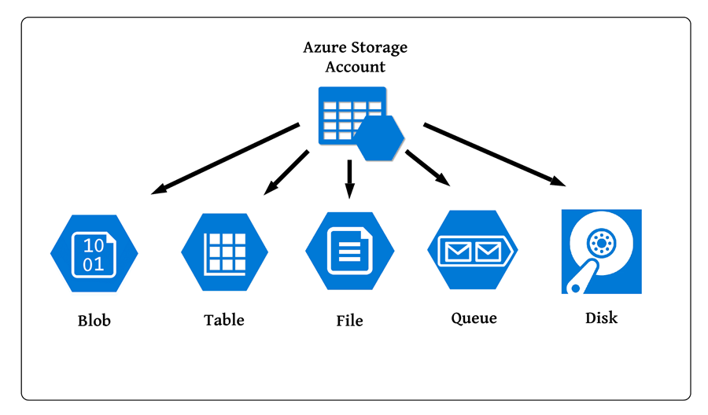
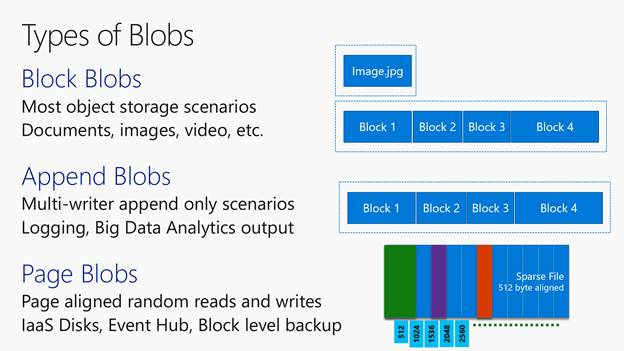
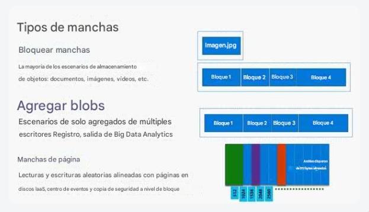
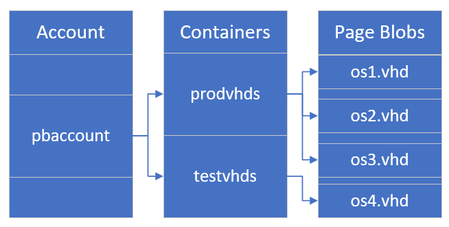
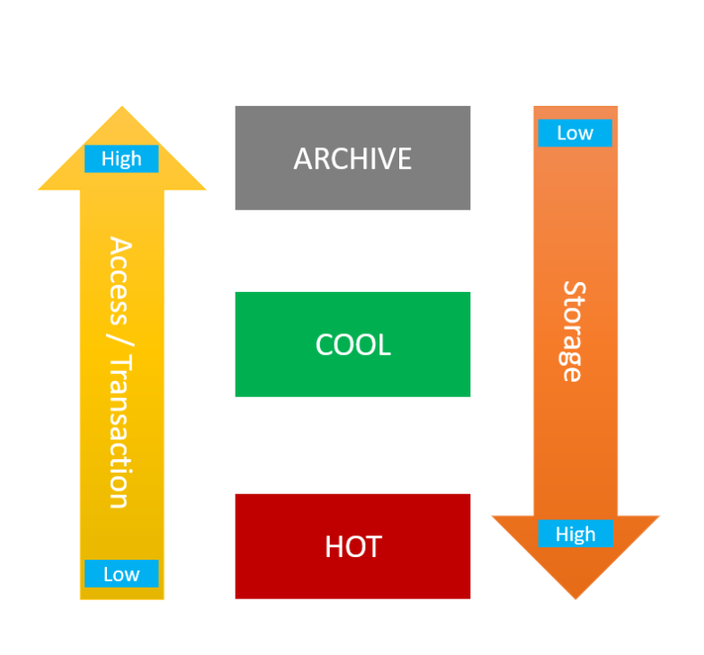
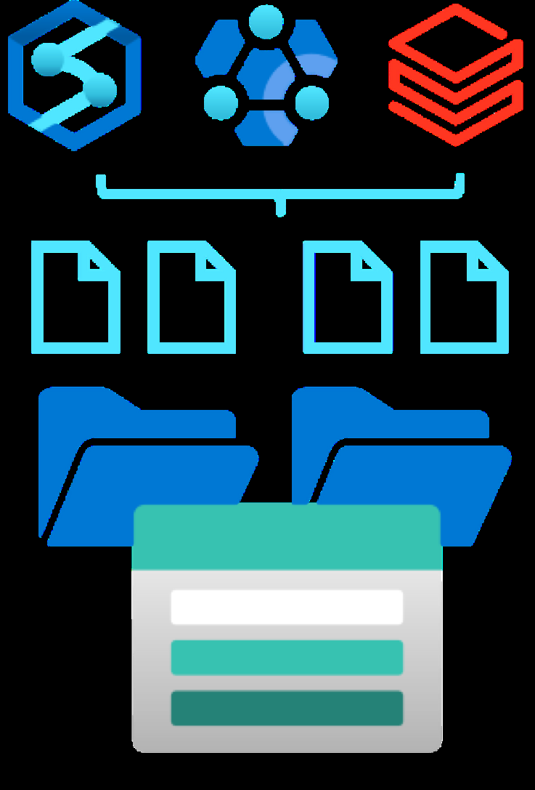
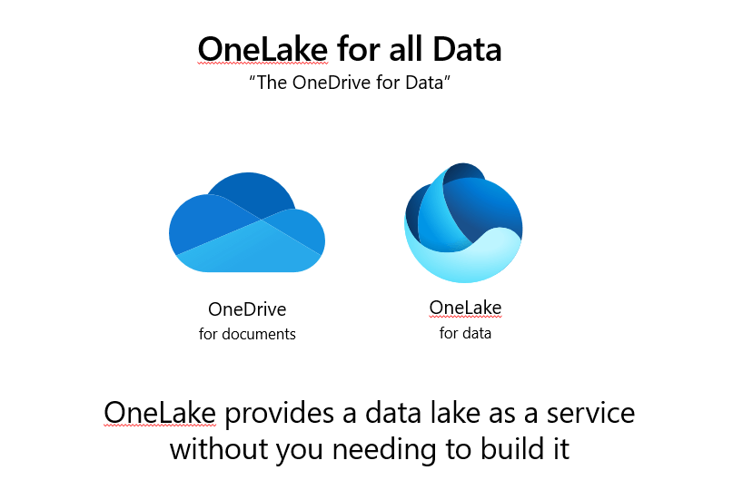
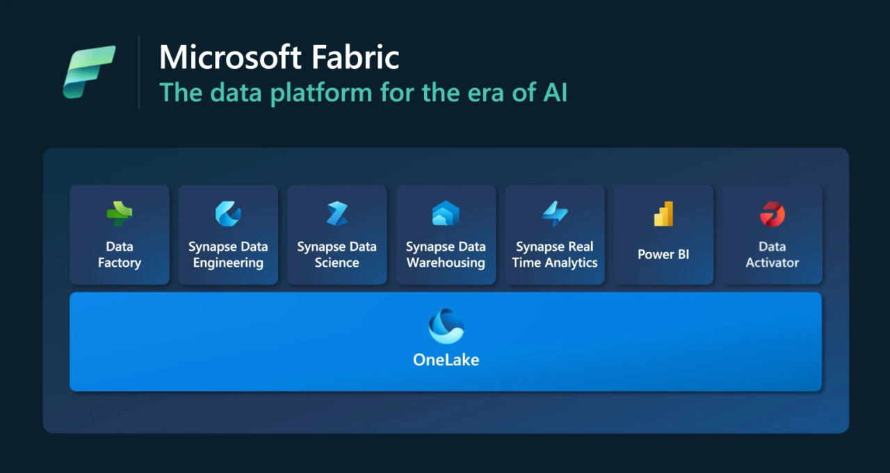
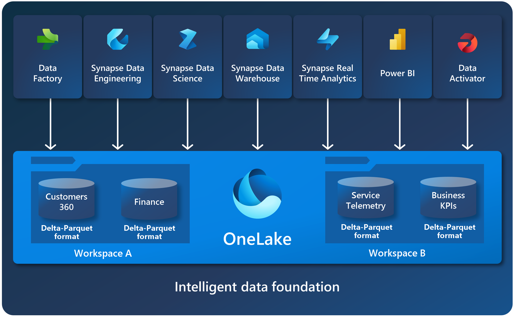
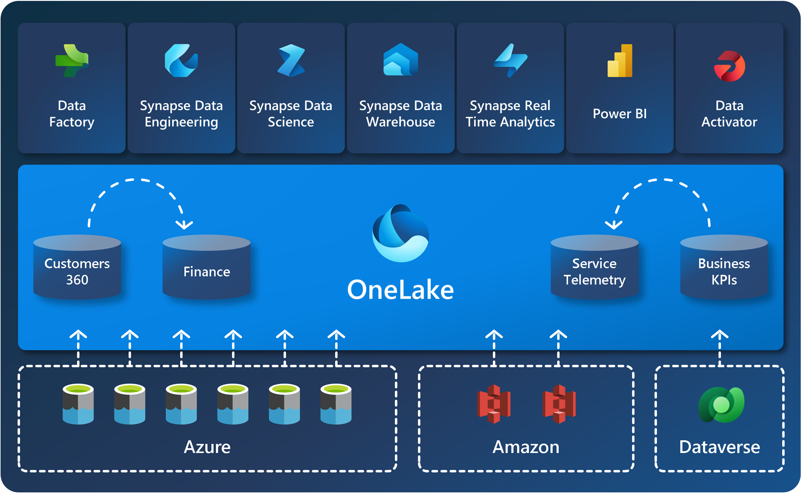

# Módulo 3: Datos no relacionales en Azure

## Clase 5

## **Almacenamiento de datos no relacionales con Azure Storage**
  - Se transmitió el: viernes 11 de Octubre a las 20:00
  - [Ver grabación](https://codigofacilito.com/videos/introduccion-almacenamiento-de-datos-no-relacionales-con-azure-storage)

# Objetivos de la clase / Introducción

Hoy nos adentraremos de forma **teórica** y **práctica** en el servicio **Azure Storage** o tambien llamada **Cuenta de almacenamiento de Azure** para el almacenamiento de información de tipo no relacional. Describiremos algunas de sus características y funcionalidades como:

- **Azure Blob Storage**
- **Azure Data Lake Gen2**
- **Azure File Storage**
- **Azure Table Storage**

De forma práctica, aprovisionaremos y usaremos una cuenta de **Azure Storage**.

---

# Tabla de contenido - Clase #5

- **/01**  
  - **Azure Storage**  
    - Breve introducción.

- **/02**  
  - **Azure Data Lake Storage Gen 2**  
    - Soluciones de análisis de macrodatos empresariales.

- **/03**  
  - **Azure Blob Storage**  
    - Almacenamiento y acceso de datos no estructurados a escala masiva en blobs en bloques.

- **/04**  
  - **Microsoft OneLake en Fabric**  
    - OneDrive para los datos.

- **/05**  
  - **Azure Files**  
    - Recursos compartidos de archivos en la nube totalmente administrados.

- **/06**  
  - **Azure Tables**  
    - Almacenamiento de datos NoSQL estructurados en la nube.

---

# /01 Azure Storage

Introducción
- **Una plataforma solución de almacenamiento en la nube de Microsoft** para los escenarios modernos de almacenamiento de datos: almacenamiento de alta disponibilidad, escalable y seguro para diversos objetos de datos en la nube.

- **Se puede acceder a los objetos de datos de Azure Storage mediante**:
  - HTTP y HTTPS
  - API REST
  - Bibliotecas cliente:
    - .NET
    - Java
    - Python
    - JavaScript
    - C++
    - Go
  - Azure PowerShell y CLI de Azure
  - Azure Portal y Explorador de Azure Storage

# Servicios de datos en Azure Storage

Algunas de las características de la **Cuenta de almacenamiento de Azure** son:

- **Azure Blobs**  
- **Azure Files**  
- **Azure Elastic SAN**  
- **Azure Queues**  
- **Azure Tables**  
- **Azure Managed Disks**  
- **Azure Container Storage** (versión preliminar)

Cada servicio se accede a través de una cuenta de almacenamiento con una dirección única.

# Creación de una Cuenta de Azure Storage (Creación de una Cuenta de almacenamiento de Azure)

1. **Abrimos Azure portal**.
2. Presionamos **Crear un recurso**.
3. Buscamos **Storage Account** en la barra de búsqueda o **Cuenta de Almacenamiento** si el portal está en español.
4. Damos clic en **Crear**.
5. Creamos el **nuevo grupo de recursos**.
6. Creamos el **nombre de la cuenta de almacenamiento** (solo acepta **minúsculas y números**, no guiones, por ejemplo).
7. Elegimos **región**.
8. El portal nos ayuda y nos ofrece elegir el **servicio principal** que le vamos a dar a la cuenta (Despues si queremos lo podemos cambiar):
   - 1) **Azure Blob Storage** o **Azure Data Lake Storage Gen 2**.
   - 2) **Azure Files**.
   - 3) **Otros** (Tablas o Colas).
9. En **Carga de trabajo principal** podemos elegir entre varias opciones:
   - Análisis de macrodatos (**Data Lake** o **Data Warehouses**).
   - Copias de seguridad y archivado.
   - Nativo en la nube para almacenamiento general (**opción seleccionada**).
   - Informática de alto rendimiento (**HPC**).
   - **Nota:** Activar **Espacio de nombres jerárquico** permite que la cuenta actúe como un **Data Lake de segunda generación**.
10. **Rendimiento:** Elegimos entre:
    - **Estándar**.
    - **Premium** (con discos de estado sólido).
11. **Redundancia:** Opciones disponibles:
    - **LRS (Almacenamiento con redundancia local)** (opción elegida: respaldo en el mismo servidor).
    - **RA-GRS (Almacenamiento con redundancia geográfica)**.
12. En **Avanzado**, podemos:
    - Habilitar **Espacio de nombres jerárquico** (convierte la cuenta en un **Data Lake Gen 2**).
    - Permitir acceso anónimo en contenedores individuales (**no recomendado**).
    - Seleccionar la **versión de TLS**.
    - Configurar **nivel de acceso** (frecuente o esporádico).
13. **Conectividad de red:** Pública o privada.
14. **Protección de datos:** Opciones disponibles:
    - **Eliminación temporal para blobs** (almacenar eliminados en papelera por días configurables).
    - **Eliminación temporal para contenedores**.
15. Finalmente, **Revisar y crear**.
16. ¡Hemos creado nuestra **cuenta de almacenamiento**!

*Si entramos en el grupo de recursos creados, y entramos en nuestra cuenta de almacenamiento, en la parte de configuracion podemos modificar todas estas caracteristicas que asignamos en la creacion de la cuenta*

---

# /02 Azure Blob Storage
Esta es un tipo de configuracion de como se va a comportar nuestra cuenta de almacenamiento.
### Solución de Almacenamiento para Datos como Objetos Binarios Grandes (BLOB)

- **Los blobs se pueden organizar en directorios virtuales.**
- Cada **ruta de acceso** se considera un **único blob** en un **espacio de nombres plano**.
- **Nota:** No se admiten operaciones de nivel de carpeta.
- **Si o si necesita de un contenedor**

Espacio de Nombres Plano
│
├── Contenedor de Blobs
│   ├── Ruta/Directorio1/File1
│   ├── Ruta/Directorio1/File2
│   ├── Ruta/Directorio2/Subdirectorio1/File3
│   ├── Ruta/Directorio2/Subdirectorio1/File4
│   ├── Ruta/Directorio2/File5
│   └── Ruta/Directorio3/File6

### Tipos de Blobs en Azure

#### 1. **Blobs en Bloques (Block Blob)**
- **Objetos binarios grandes y discretos** **que cambian con poca frecuencia**.
- Tamaño máximo: **4,7 TB**, compuesto por bloques de hasta **4000 MB**.
- Cada blob puede contener hasta **50 000 bloques**.

#### 2. **Blobs en Anexos (Append Blob)**
- **Blobs en bloques optimizados para operaciones de anexión.**
- **Por ejemplo las bitacoras , BITCOIN?**
- **No se pueden actualizar , no se pueden eliminar los datos**
- Tamaño máximo: **195 GB**, con bloques de hasta **4 MB**.

#### 3. **Blobs en Páginas (Page Blob)**
- **Para lecturas y escrituras aleatorias, por eso se usa para discos duros**
- **Usado como almacenamiento en disco virtual para máquinas virtuales.**
- Tamaño máximo: **8 TB**, compuesto por páginas de **512 bytes** de tamaño fijo.

  

### Niveles de Acceso por Blobs

#### 1. **Frecuente (Hot):**
- **Mayor costo de almacenamiento.**
- **Menor costo de acceso.**
- **Latencia más baja.**

#### 2. **Esporádico (Cool):**
- **Menor costo de almacenamiento.**
- **Mayor costo de acceso.**
- **Más latencia.**

#### 3. **Archivo (Archive):**
- **Menor costo de almacenamiento.**
- **Mayor costo de acceso.**
- **Latencia más alta.**

Demo Azure Blob Storage

---

# /03 Azure Data Lake Storage Gen 2
Esta es otro tipo de configuracion de como se va a comportar nuestra cuenta de almacenamiento.
Sistema de archivos distribuido basado en Blob Storage (Un caso especial del Blob Storage)
El objetivo principal no es almacenar informacion, sino que con otras tecnologias Apache Spark o Databricks puedan consimirse los datos como asi tambien procesarlos. (Tambien Fabric).
Es un servicio PasS 

- **Sistema de archivos distribuido** basado en **Blob Storage**.
- Combina **Azure Data Lake Store Gen1** con **Azure Blob Storage** para:
  - **Almacenamiento** y **análisis** de archivos a gran escala.
- **Habilita el control y la administración de acceso** a nivel de:
  - **Archivo**.
  - **Directorio**.
- **Compatible con sistemas analíticos** a gran escala comunes.

- **Cuenta de Azure Storage**.
- Contiene un **Contenedor de blobs** que organiza:
  - **Directorios**.
  - **Archivos**: Por ejemplo, **File1** y **File2**.
- **Espacio de nombres jerárquico** que estructura el sistema de archivos.
  
Azure Data Lake Store Gen 2
│
├── Cuenta de Azure Storage
│   └── Contenedor de blobs
│       ├── Directorio 1
│       │   ├── File1
│       │   └── File2
│       ├── Directorio 2
│       │   ├── Subdirectorio 1
│       │   │   ├── File3
│       │   │   └── File4
│       │   └── File5
│       └── Directorio 3
│           └── File6

**El sistema de archivos incluye directorios y archivos, y es compatible con sistemas de análisis de datos a gran escala, como Hadoop, Databricks y Azure Synapse Analytics**.

Habilitado en una cuenta de Azure Storage mediante la opción: **Espacio de nombres jerárquico**

- Establecido durante la creación de la cuenta de almacenamiento.
- Se puede actualizar la cuenta de almacenamiento existente.
- Proceso de actualización unidireccional. **Quiere decir que no se puede volver a modificar** siempre se va a comportar como un DataLake Storage Gen 2
- Una vez cambiada de blob a esta, sigue soportando File Services , Queue(cola) Services, Tables Services.

# Cargas de Trabajo

- **Procesamiento y análisis de macrodatos**
- **Almacenamiento de datos**
- **Análisis de datos en tiempo real**
- **Ciencia de datos y machine learning**

# Demo Azure Data Lake Store Gen2

---

# /04 Microsoft OneLake en Fabric

Tambien llamado el OneDrive para los Datos.
OneLake es un servicio que ya **viene aprovisionado,incluido en Fabric** .
Es como el Data Lake pero este es un **servicio SasS (Software as a Service)**

# OneLake para todos los datos

- **OneDrive para documentos**
- **OneLake para datos**

**OneLake** ofrece un lago de datos como servicio, eliminando la necesidad de crearlo manualmente.

- OneLake viene con Power BI, Synapse Data Warehousing, Synapse Data Science, Synapse Data Engineering, Synapse Real Time Analytics.

# Microsoft Fabric – OneLake

- **OneLake** es un lago de datos único, unificado y lógico diseñado para toda su organización. (Con uno solo alcanza para toda la organizacion)
- OneLake viene automáticamente con todos los tenants de **Microsoft Fabric** y sirve como repositorio central para todos los datos de análisis.
- Ya sea estructurado o no estructurado, **OneLake** admite cualquier tipo de archivo y permite usar los mismos datos en varios motores analíticos sin movimiento de datos ni duplicación.
- Es decir que desde OneLake se pueden traer y usar datos de Amazon Google etc.

# Ventajas

- **El lago de datos de toda la organización**.
- **Propiedad distribuida y colaboración**.
- **Abierto y compatible**.
- **Fácil de navegar**.

Exploración de OneLake en Fabric

- Aca podemos conectarnos a un Lakehouse que de esta forma se le llama a los Data Lake de segunda generación dentro de OneLake

---

# /05 Azure Files o Azure Files Storage

- Es una funcionalidad mas de la cuenta de almacenamiento.
- **Sirve para crear recursos compartidos de archivos en la nube** a los que se puede acceder desde cualquier lugar con una conexión a Internet.

- Admite como máximo 100 TB de información compartida en cada cuenta de almacenamiento, cada archivo como máximo de 1 TB y como máximo 2000 conexiones simultáneas para cada archivo.

## Compatibilidad con protocolos comunes de uso compartido de archivos:
- **Bloque de mensajes del servidor (SMB)**: es el que nos ofrece el nivel Estándar
- **Network File System (NFS)**: requiere el nivel Premium

## Características:
- Los datos se replican para garantizar la redundancia.
- Cifrado en reposo para mayor seguridad.

## Azure File Storage ofrece dos niveles de rendimiento:
- **Nivel Estándar**: Usa hardware basado en disco duro.
- **Nivel Premium**: Usa discos de estado sólido.

## Azure Files admite dos protocolos comunes de uso compartido de archivos de red:
- **SMB**: Server Message Blocks (Windows, Linux, macOS).
- **NFS**: Network File System (algunas versiones de Linux y macOS).

Demo Azure Files

Aca es dónde podemos crear un fileshare o en español recursos compartidos de archivos
El equipo donde se crea, debe tener habilitado el puerto 445

---

# /06 Azure Tables

Si bien se ve como una tabla es una **Solución de almacenamiento NoSQL**
Porque cada elemento tiene sus propias columnas si es necesario, no se tienen que relacionar
**Almacenamiento de clave-valor para los datos de la aplicación**

*En la actualidad se usa mas Cosmos DB*

## Características:
- Las tablas constan de columnas de clave y valor.
  - **Claves de partición y fila**
  - **Columnas de propiedades personalizadas** para valores de datos.
  - **Columna Timestamp** agregada automáticamente para registrar los cambios en los datos.

- **Las filas se agrupan en particiones** para mejorar el rendimiento.
- **Se asignan columnas de propiedad** a un tipo de datos y pueden contener cualquier valor de ese tipo.
- **No es necesario que las filas incluyan las mismas columnas de propiedad**.

Demo Azure Tables

---

# Preguntas

1. **¿Cuáles son los elementos de una clave de Azure Table Storage?**  
   - [ ] A) Nombre de tabla y nombre de columna.  
   - [x] B) Clave de partición y clave de fila.  
   - [ ] C) Número de fila.  

2. **¿Qué debe hacer con un inquilino de Microsoft Fabric existente para ser compatible con un lago de datos?**  
   - [ ] A) Incorporación de un recurso compartido de Azure Files  
   - [ ] B) Creación de tablas de Azure Storage para los datos que quiere analizar  
   - [x] C) No se requiere ninguna acción.  

3. **¿Para qué podría usar Azure File Storage?**  
   - [ ] A) Para compartir archivos que se almacenan de forma local con usuarios ubicados en otros sitios.  
   - [x] B) Para permitir que los usuarios de distintos sitios compartan archivos de red.  
   - [ ] C) Para almacenar archivos de datos binarios grandes que contienen imágenes u otros datos no estructurados.  

4. **¿Qué debe hacer en una cuenta de Azure Storage existente para admitir un lago de datos para Azure Synapse Analytics?**  
   - [ ] A) Incorporación de un recurso compartido de Azure Files  
   - [ ] B) Creación de tablas de Azure Storage para los datos que quiere analizar  
   - [x] C) Actualización de la cuenta para habilitar el espacio de nombres jerárquico y crear un contenedor de blobs.
  
---

  # ¿Qué has aprendido hoy?

Azure Storage es un servicio clave de Microsoft Azure y permite una amplia gama de soluciones y escenarios de almacenamiento de datos.

- Describir las características y las funcionalidades de:
  - Azure Blob Storage
  - Azure Data Lake Gen2
  - Microsoft OneLake
  - Azure File Storage
  - Azure Table Storage
- Aprovisionar y usar una cuenta de Azure Storage

---

# ¿Cuándo utilizar cada servicio?

## Azure Blob Storage
- Copia de seguridad o archivado de datos relacionados con aplicaciones y VMs.
- Alojamiento y transmisión de imágenes, archivos de audio y vídeos.
- Análisis de big data.
- Almacenamiento en caché y distribución de contenido para sitios web.
- Almacenamiento de objetos de archivos de registro y datos de telemetría para fines de supervisión, depuración o análisis.

## Azure File Storage
- Almacenamiento de archivos compartidos para la colaboración en un área dispersa geográficamente.
- Transferencia a la nube de aplicaciones que utilizan API nativas y SMB.
- Reemplazo o complemento de servidores de archivos locales.
- Agregación de registros y datos para procesamiento y análisis centralizados.
- Gestión central de archivos de configuración para múltiples instancias de aplicaciones.
- Almacenamiento de archivos para entornos de desarrollo y prueba.

## ¿Cuándo utilizar Azure Table Storage?

- Almacenamiento centralizado de registros, datos de telemetría y datos de monitoreo.
- Almacenamiento de datos de catálogos y carritos de compras para aplicaciones de comercio electrónico.
- Programación de tareas escalable y almacenamiento de metadatos.
- Almacenamiento de datos sensoriales y datos de telemetría de IoT.
- Almacenamiento de datos de configuración para aplicaciones en la nube.

# Directorio de Links

- [Exploración de Azure Storage para datos no relacionales](https://learn.microsoft.com/es-mx/training/modules/explore-provisiondeploy-non-relational-data-services-azure/)
- [Exploración de Azure Storage](https://aka.ms/dp900-storage-lab)