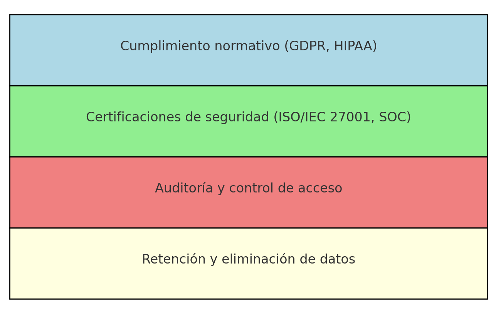

# Módulo 3: Datos no relacionales en Azure

## Clase 6

## **Almacenamiento escalable de datos no relacionales con Azure Cosmos DB**
  - Se transmitió el: miércoles 23 de Octubre a las 20:00
  - [Ver grabación](https://codigofacilito.com/videos/introduccion-almacenamiento-escalable-de-datos-no-relacionales-con-azure-cosmos-db)

---

# Agenda

/01 **Introducción a Azure Cosmos DB**  
/02 **Modelos de Consistencia y Particiones**  
/03 **APIs soportadas por Cosmos DB**  
/04 **Escalabilidad y rendimiento**  
/05 **Seguridad y gobernanza de datos**  
/06 **Key Tips**  
/07 **Validemos lo Aprendido Hoy**

---

# /01 Introduccióna Azure CosmosDB

## ¿Qué es Azure Cosmos DB?

Base de datos NoSQL totalmente administrada diseñada para proporcionar:
- Una latencia baja (Es decir una respuesta rápida).
- Una escalabilidad elástica del rendimiento (Escalabilidad ilimitada se podria decir tambien).
- Una semántica bien definida para la coherencia de los datos. Con coherencia se refiere a que tan actuales son los datos que estoy viendo.
- Una alta disponibilidad.

## Ventajas y Capacidades Únicas

- Escalabilidad de escritura y lectura elásticas ilimitada.
- Hasta un 99,999% de disponibilidad de lectura y escritura en todo el mundo.
- Garantía de rendimiento en lecturas y escrituras atendidas en menos de 10 milisegundos en el percentil 99.
- Ejecutar una base de datos en varias regiones aumenta la disponibilidad de la base de datos.

## Elementos de una cuenta de Azure Cosmos DB

- Al comienzo del diagrama al lado izquierdo indica todo lo que hay dentro de una base de datos
- De este grafico podemos ver que si el contenedor es una tabla el elemento es una fila.
- Si el contenedor es un grafo el elemento es un nodo
- Si el contenedor es una recopilacion el elemento es un documento

- Tambien podemos ver si la API que usamos es Gremblin el contenedor es un grafo
- Si la API es de documentos el contenedor es una coleccion
- Si la API es de tablas nuestro contenedor es una tabla

## Niveles de Coherencia

Azure Cosmos DB se aproxima a la coherencia de datos como un espectro de opciones en lugar de como dos extremos.  
**Coherencia se refiere a si los datos son los mas nuevos** , **Es la garantía de obtener la versión más reciente de los datos**
Ofrece cinco niveles bien definidos. De más fuerte a más débil, los niveles son:

Acá podemos elegir si queremos mejor rendimiento o mayor disponibilidad segun las necesidades.
- Si es **Alta** significa que los datos son los mas actuales pero tienen menos rendimiento y es más costosa. Hay que esperar ,ucho para que todo se sincronice
- **Sesión** la más común es el que viene por defecto
- **Ocasional** es el que brinda datos no tan actuales pero tiene baja latencia y los datos se obtienen mas rápido

---

# /02 Modelos de Consistencia y Particiones

## Modelos de Consistencia

Azure Cosmos DB ofrece cinco modelos de consistencia, que pueden considerarse un espectro que varía en función de la relación entre la consistencia y el rendimiento.

*Coincide la Consistencia con la Coherencia.*

## Particiones en Cosmos DB

Azure Cosmos DB utiliza **particiones para distribuir datos de manera eficiente** y **escalar horizontalmente** (o paralelamente varios a la vez).  
La clave de partición es un aspecto fundamental en este proceso, ya que determina cómo los datos se dividen y distribuyen entre diferentes particiones.

*Datos distribuidos equitativamente, de forma paralela para buscar los datos (por ejemplo realizar una consulta) más rapidamente, sin sobrecargar ningun servidor, ninguna region*

---

# /03 APIs soportadas por Cosmos DB

## Modelos de datos y APIs compatibles

Estas API permiten que las aplicaciones traten Azure Cosmos DB como si fueran otras tecnologías de bases de datos, sin la sobrecarga de los enfoques de administración y escalado.

## Consideraciones al elegir una API

- La API para NoSQL es nativa de Azure Cosmos DB. (Se guarda en un JSON)
- Si tiene aplicaciones existentes de MongoDB, PostgreSQL, Cassandra o Gremlin.
- Si no quiere reescribir toda la capa de acceso a datos.
- Si quiere usar el ecosistema para desarrolladores de código abierto, los controladores de cliente, la experiencia y los recursos de su base de datos.

---

# /04 Escalabilidad y rendimiento

## Escalabilidad horizontal

Azure Cosmos DB utiliza la **escalabilidad horizontal** para distribuir datos y solicitudes entre múltiples servidores, lo que permite manejar grandes volúmenes de datos y operaciones sin afectar el rendimiento.

*El escalado vertical se refiere a aumento de recursos, memoria , nucleos, discos, etc. Todo sobre un mismo servidor*

## Unidades de Solicitudes

- Paga por el rendimiento que aprovisiona y el almacenamiento que consume cada hora.
- Azure Cosmos DB normaliza el coste de todas las operaciones de base de datos y este se expresa en **unidades de solicitud** (o **RU**, para abreviar).
- Una **unidad de solicitud** representa los recursos del sistema, como CPU e IOPS, y la memoria que se necesitan para realizar las operaciones de base de datos que admite Azure Cosmos DB.

*Podemos aprovisionar los RU unidades de solicitud que queremos utilizar*

---

# /05 Seguridad y gobernanzadedatos

## Seguridad en Cosmos DB

Azure Cosmos DB ofrece una amplia gama de características de seguridad que **garantizan la protección de los datos en todo momento**. Estas incluyen:

- **Cifrado de datos en tránsito (cuando los datos se van moviendo) y reposo (cuando los datos estan guardados)** para proteger la información sensible .
- **Control de acceso basado en roles (RBAC)** para definir permisos a usuarios o aplicaciones
- **Integración con Active Directory (ADD)**
- **Auditoría y monitoreo**

## Gobernanza y cumplimiento

- **Cumplimiento normativo (GDPR, HIPAA)**
- **Certificaciones de seguridad (ISO/IEC 27001,SOC)**
- **Auditoría y control de acceso**
- **Retención y eliminación de datos**

---

# /06 Mejores Prácticas

## Mejores Prácticas para Optimización

- **Clave de partición adecuada**: Selecciona una clave de partición óptima para garantizar un rendimiento eficiente y escalabilidad.
- **Optimización de Request Units (RUs)**: Ajusta las RUs según las necesidades de tu aplicación para optimizar el coste y el rendimiento.
- **Indexación personalizada**: Configura opciones de indexación personalizadas para mejorar las consultas y reducir el consumo de recursos.
- **Modelo de consistencia ajustado**: Adapta el modelo de consistencia según los requisitos de tu aplicación para equilibrar latencia y rendimiento.

---

# /07 Validemos lo Aprendido Hoy

## Cuestionario

1. ¿Cuál es el nivel de consistencia más eficiente para aplicaciones que no requieren datos siempre actualizados pero buscan alta disponibilidad?
   - [ ] a) Consistencia fuerte
   - [ ] b) Consistencia de prefijo
   - [ ] c) Consistencia de sesión
   - [x] d) Consistencia eventual

2. ¿Qué opción describe mejor cómo Cosmos DB escala horizontalmente?
   - [ ] a) Agregando más recursos a un solo servidor
   - [x] b) Dividiendo los datos en particiones que se distribuyen entre múltiples servidores
   - [ ] c) Utilizando múltiples claves de partición por solicitud
   - [ ] d) Replicando los mismos datos en todos los servidores sin particionarlos

3. ¿Qué función tiene el control de acceso basado en roles (RBAC) en Cosmos DB?
   - [ ] a) Permitir consultas rápidas entre particiones
   - [ ] b) Monitorear el consumo de Request Units
   - [x] c) Gestionar quién tiene acceso a leer o escribir datos en la base de datos
   - [ ] d) Eliminar automáticamente datos obsoletos

4. ¿Cuál es una de las mejores prácticas para optimizar el consumo de Request Units (RUs) en Cosmos DB?
   - [ ] a) Utilizar siempre la consistencia fuerte
   - [ ] b) Evitar crear índices personalizados
   - [x] c) Ajustar el aprovisionamiento de RUs según las necesidades reales
   - [ ] d) Escanear todas las particiones con cada consulta

