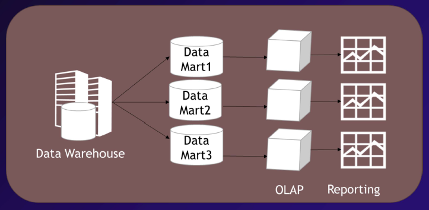

# Módulo 4: Datos no relacionales en Azure

## Clase 7

## **Fundamentos de analítica de datos moderna a gran escala y en tiempo real**
  - Se transmitió el: viernes 25 de Octubre a las 20:00
  - [Ver grabación](https://codigofacilito.com/videos/introduccion-fundamentos-de-analitica-de-datos-moderna-a-gran-escala-y-en-tiempo-real)

# Temario

1. **Fundamentos**
   - **Hablemos de datos**
   - **¿Qué es la analítica de datos?**
   - **¿Qué es Business Intelligence?**
   - **Inmon vs Kimball**
2. **Arquitecturas modernas de datos en Azure**
3. **Demo**

## ¿Por qué son importantes los datos?

Los datos han sido siempre un activo esencial para el crecimiento de una organización.  
Un dato que no se guarda es un dato que no hace historia.  
Los datos perdurarán más que los sistemas mismos.

## ¿Qué son los datos?

Colección de hechos, números, descripciones y objetos, almacenados de forma estructurada, semiestructurada y no estructurada.

## ¿Qué es la analítica de datos?

- La **analítica de datos** es un proceso que se basa en el uso de **herramientas** y **métodos** para convertir **datos** en **información útil** para tomar **decisiones**. Se encarga de **procesar datos sin procesar** para obtener **conclusiones** sobre la información que contienen.
- La **analítica de datos es un proceso fundamental en Business Intelligence**, que es un conjunto de procesos diseñados para **optimizar el desempeño organizacional** y mejorar la **toma de decisiones** de una empresa.
- La analítica de datos puede:
  - **Ayudar a las empresas a comprender su pasado**.
  - **Determinar su futuro**.
  - **Transformar los negocios**.
  - **Acelerar la innovación**.
  - **Predecir resultados futuros**.

- **Ejemplos de Aplicaciones de la Analítica de Datos**

  - **Gestión de datos de clientes**
  - **Personalización de la experiencia de usuario**
  - Ciberseguridad y detección de anomalías
  - Detección de fraudes
  - Gestión del riesgo
  - Análisis de operaciones
  - Realización de estudios de mercado

- **Tipos de Análisis de Datos más Comunes**

  - **Descriptivo**
  - **Diagnóstico**
  - Predictivo
  - Prescriptivo

## **¿Qué es Business Intelligence?**

- **Business Intelligence (BI)** o **inteligencia de negocios** es el proceso de **recopilar, analizar y utilizar datos** para ayudar a las empresas a tomar decisiones estratégicas y cotidianas.  
- El BI se vale de tecnologías, aplicaciones y prácticas para:  
  - **Analizar grandes volúmenes de datos**.  
  - **Anticipar tendencias**.  
  - Definir patrones.  
  - **Convertir los datos en información estratégica accionable**.  
  - Ayudar a los usuarios a seleccionar y manipular los datos que les interesen.  
- El BI combina:  
  - **Análisis de negocios**.  
  - **Minería de datos**.  
  - **Visualización de datos**.  
  - Herramientas e infraestructura de datos.  

- **Algunas soluciones de BI:**
  - **Creación de informes predefinidos y a medida.**  
  - **Distribución automatizada de informes.**  
  - **Previsión de resultados.**  
  - Herramientas de consultas para usuarios avanzados.  
  - **Cuadros de mando.**  
  - **Almacenes de datos especiales.**

## Esquema BI

*Data Integration tambien conocido como ETL O ELT*

A continuacion vamos a ver los distintos Procesos de **Inteligencia de Negocios** o **Business Intelligence** . A medida que avancemos se van complejizando los modelos.

## Proceso básico de Inteligencia de Negocios

.

- Aca podemos ver una Fuente de datos
- Un paso intermedio de limpieza de datos
- Luego pasa a las reglas de negocios que lo lleva a un Data Warehouse.
- Finalmente acceso al cliente
  

## Bill Inmon Vs Ralph Kimball

Tenemos 2 corrientes

## Inmon

- **Bill Inmon**, conocido como el "Padre del Data Warehouse", es el creador del concepto del esquema **snowflake** o **copo de nieve**, utilizado en el diseño de bases de datos.  
- Usando el **data warehouse**, se generan **data marts** que organizan la información por temas específicos:  
  - Ejemplo: Data Mart 1 para ventas, Data Mart 2 para recursos humanos, Data Mart 3 para clientes, etc.  
  - Estos **data marts** pueden contener datos en común entre ellos, facilitando la integración para análisis cruzados.  
- La metodología de Inmon comienza agrupando todos los datos en un único **almacén de datos** o **data warehouse**, antes de fragmentarlos en unidades más pequeñas (**data marts**) para separar y optimizar la información.  
- El esquema **snowflake** utiliza normalización en las tablas de datos, lo que hace que sean más eficientes para análisis y consultas.  

## Inmon Detallado

Aquí podemos observar un desglose más específico de la información:  

### **Información de entrada hacia los Data Marts:**  
- **Transacciones de orden**  
- **Inventario del registro instantáneo de datos**  
- **Transacciones de embarque**  

### **Proceso derivado hacia el Data Warehouse:**  
1. **Adquisición de datos del Data Warehouse (DW) en la tercera forma normal (3NF)**  
2. **Transformación hacia un DW normalizado**  
3. **Producción de datos entregables para Data Marts dimensionales**  

### **Derivaciones posibles de los Data Marts:**  
- **Data Warehouse de ventas**  
- **Data Mart de marketing**  
- **Data Mart de finanzas**  

## Kimball

- **Ralph Kimball** es conocido por crear el modelo de estrella o **star schema**, un enfoque ampliamente utilizado en el diseño de bases de datos para análisis de datos.  
- Kimball argumentó que no tenía sentido juntar toda la información en un único lugar si luego se iba a dividir para su análisis.  
- Su enfoque consiste en **reunir primero la información separada**, organizándola de manera lógica y accesible, y luego integrarla dentro del **data warehouse**.  
- A diferencia de Inmon, Kimball se enfoca en crear **data marts temáticos desde el principio**, diseñados para responder a necesidades analíticas específicas, y conectarlos a un data warehouse de forma descentralizada.  
- El **modelo de estrella** se caracteriza por una tabla de hechos central (hechos cuantitativos) conectada a tablas de dimensiones (información descriptiva), facilitando la navegación y el análisis.  
- 

## Kimball Detallado

Aquí podemos observar un desglose más específico de la información:

### **Información de entrada hacia los Data Marts:**
- **Transacciones de orden**  
- **Inventario del registro instantáneo de datos**  
- **Transacciones de embarque**  

### **Proceso hacia el Data Warehouse:**
1. Se utiliza una plataforma de datos para un **Data Warehouse (DW) dimensional** bajo una **arquitectura bus del DW**.  
2. En esta arquitectura bus del DW, los elementos clave incluyen:  
   - **Órdenes**  
   - **Inventario**  
   - **Pagos**  
   - **Línea de órdenes**  

### **DW Dimensional:**
- En el centro del proceso, se encuentra el **DW Dimensional**, que incluye:  
  - **Datos atómicos:** Información detallada.  
  - **Datos resumen:** Información consolidada para análisis.  

Base de datos, tabla de hechos con el concepto estrella

# Arquitectura simplificada
Estos esquemas como Inmon o Kimball evolucionaron y hoy se pueden ver de esta manera en Azure.

Este esquema representa un flujo generalizado para gestionar y aprovechar los datos dentro de un entorno empresarial.

### **Etapas del proceso:**

1. **Legacy Data Warehousing Solution:**  
   - La solución tradicional de almacenamiento de datos (Legacy) como punto de partida, que puede incluir sistemas heredados o estructuras más antiguas de warehousing.

2. **Data Pipeline (Tubería de Datos):**  
   - En esta etapa se realiza el **ETL** (Extract, Transform, Load) o **ELT** (Extract, Load, Transform), donde:  
     - Se extraen datos desde diversas fuentes.  
     - Los datos se transforman según las necesidades analíticas.  
     - Finalmente, se cargan en un entorno de almacenamiento.  

3. **Almacenamiento y Procesamiento:**  
   - Dependiendo de los requerimientos, el almacenamiento y procesamiento puede implementarse mediante:  
     - **SQL Database**  
     - **Instancia administrada**  
     - **Máquina virtual**  
   - Estas opciones garantizan flexibilidad para manejar diferentes tipos de carga de trabajo.

4. **Presentación de la Información en Microsoft Fabric:**  
   - Los datos procesados se integran y visualizan a través de **Microsoft Fabric**, una herramienta que permite crear reportes y cuadros de mando interactivos.

5. **Consumo por los Usuarios:**  
   - Finalmente, los usuarios consumen la información procesada para generar insights y tomar decisiones estratégicas. Por ejemplo en Power BI

# Arquitectura completa

Este esquema describe de manera detallada las etapas clave para la gestión, transformación y consumo de datos dentro de un entorno empresarial, utilizando las avanzadas capacidades de la nube de Azure.

*Azure Data Factory: Es un servicio SaaS de integración y orquestación de datos en la nube que permite mover, transformar y automatizar flujos de datos entre diversas fuentes y destinos, optimizando el procesamiento y análisis*

### **Etapas del Proceso:**

A. **Carga e Ingesta (Load and Ingest):**  
   - **Data Factory Pipeline:**  
     Responsable de la extracción de datos provenientes de fuentes diversas, incluyendo información no estructurada, semiestructurada y estructurada.  
   - **Event Hubs:**  
     Diseñado para ingerir flujos de datos en tiempo real, capturando eventos desde aplicaciones, dispositivos o sistemas, y preparándolos para etapas posteriores.  

B. **Almacenamiento (Store):**  
   - **Azure Data Lake Storage (ADLS):**  
     Funciona como repositorio principal para datos provenientes de **Event Hubs**, **Data Factory Pipeline** y **Microsoft Dynamics 365**, garantizando escalabilidad y eficiencia.  
   - **SQL Database:**  
     Almacena datos estructurados procesados desde **Data Factory Pipeline**, proporcionando capacidades óptimas para consultas específicas.  
   - **Azure Cosmos DB:**  
     Ideal para el manejo de datos distribuidos globalmente, con soporte para baja latencia y alta escalabilidad, facilitando la ingesta desde fuentes como **Event Hubs** y **Data Factory Pipeline**, así como aplicaciones personalizadas.  

> ### **Microsoft Fabric**
> 
> C. **Procesamiento y Manipulación (Process/Manipulate):**  
>    - **OneLake:**  
>      Integra los datos almacenados en **ADLS**, preparándolos para análisis avanzados y modelados predictivos dentro del entorno de Fabric.  
>    - **Real-Time Analytics:**  
>      Procesa datos en tiempo real directamente desde **Event Hubs**, generando análisis inmediatos y relevantes, optimizados por Fabric.  
> 
> D. **Colaboración y Consumo (Collaborate/Consume):**  
>    - **SQL Analytics Endpoint:**  
>      Permite realizar análisis SQL de manera rápida y optimizada sobre los datos procesados dentro del ecosistema de Fabric.  
>    - **Spark Pool:**  
>      Facilita el procesamiento distribuido y escalable para grandes volúmenes de datos en el entorno de Fabric.  
>    - **Pipelines:**  
>      Automatiza flujos de trabajo, asegurando la preparación de los datos para su consumo final dentro de Fabric.  

E. **Presentación y Uso (Consume/Serve):**  
   - Los datos son presentados y consumidos a través de herramientas poderosas y versátiles como:  
     - **Power Apps**: Ideal para construir aplicaciones personalizadas.  
     - **Microsoft Dynamics 365**: Integración con sistemas empresariales clave.  
     - **Power BI**: Visualización avanzada mediante reportes interactivos.  
     - **Function App**, **Logic App** y **Web App**: Amplían las posibilidades de procesamiento y presentación dinámica.

